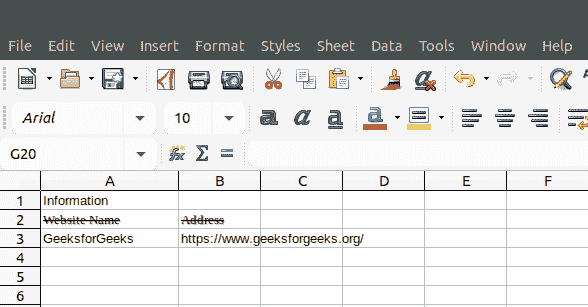
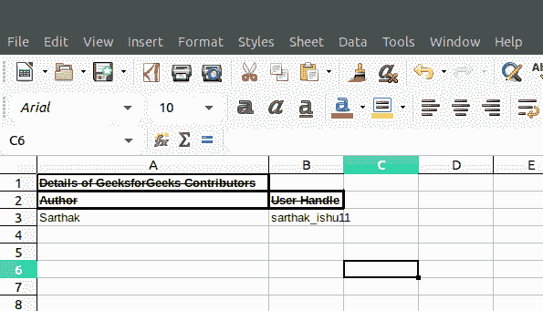

# PHP|Spreadsheet_Excel_Writer|setStrikeOut()函数

> Original: [https://www.geeksforgeeks.org/php-spreadsheet_excel_writer-setstrikeout-function/](https://www.geeksforgeeks.org/php-spreadsheet_excel_writer-setstrikeout-function/)

SetStrikeOut()函数是 PHP|Spreadsheet_Excel_Writer 中的内置函数，用于将字体设置为删除线。

**语法：**

```php
*void* Format::setStrikeOut()
```

**参数：**此函数不接受任何参数。

**返回值：**此函数成功时返回 TRUE，失败时返回 PEAR_ERROR。

**示例 1：**

## PHP

```php
<?php

require_once 'Spreadsheet/Excel/Writer.php';

// Create Spreadsheet_Excel_Writer Object
$workbook = new Spreadsheet_Excel_Writer();

// Add Worksheet
$worksheet =& $workbook->addWorksheet();

// Set Font Family Times New Roman
$format_times =& $workbook->addFormat();
$format_times->setFontFamily('Times New Roman');

// Set StrikeOut
$format_times->setStrikeOut();

// Set Shadow to text
$format_times->setShadow();

// Write to Worksheet
$worksheet->write(0, 0, "Information");
$worksheet->write(1, 0, "Website Name", $format_times);
$worksheet->write(1, 1, "Address", $format_times);
$worksheet->write(2, 0, "GeeksforGeeks");
$worksheet->write(2, 1, "https://www.geeksforgeeks.org/");
$workbook->send('test.xls');

$workbook->close();
?>
```

发帖主题：Re：Колибри0.7.0



**示例 2：**

## PHP

```php
<?php

require_once 'Spreadsheet/Excel/Writer.php';

// Add Workbook
$workbook = new Spreadsheet_Excel_Writer();

// Add Format to spreadsheet
$format_bold =& $workbook->addFormat();

// Set Bold Format
$format_bold->setBold();

// Set StrikeOut
$format_bold->setStrikeOut();

// Add Worksheet to Spreadsheet
$worksheet =& $workbook->addWorksheet();

$format_bold->setBorder(2);

// Write to Worksheet
$worksheet->write(0, 0, "Details of GeeksforGeeks
                     Contributors", $format_bold);
$worksheet->write(1, 0, "Author", $format_bold);
$worksheet->write(1, 1, "User Handle", $format_bold);
$worksheet->write(2, 0, "Sarthak");
$worksheet->write(2, 1, "sarthak_ishu11");

// Send .xlsx file to header
$workbook->send('test.xls');

// Close Workbook Object
$workbook->close();
?>
```

发帖主题：Re：Колибри0.7.0



**引用：**[https://pear.php.net/manual/en/package.fileformats.spreadsheet-excel-writer.spreadsheet-excel-writer-format.setstrikeout.php](https://pear.php.net/manual/en/package.fileformats.spreadsheet-excel-writer.spreadsheet-excel-writer-format.setstrikeout.php)