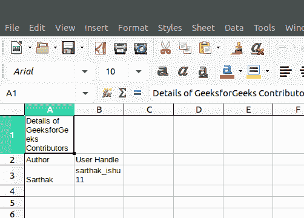
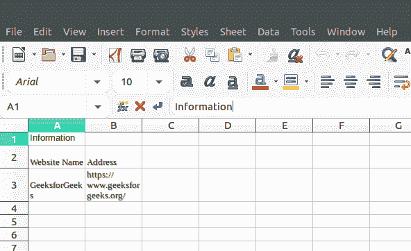

# PHP|Spreadsheet_Excel_Writer|setTextWrap()函数

> Original: [https://www.geeksforgeeks.org/php-spreadsheet_excel_writer-settextwrap-function/](https://www.geeksforgeeks.org/php-spreadsheet_excel_writer-settextwrap-function/)

SetTextWrap()函数是 PHP|Spreadsheet_Excel_Writer 中的内置函数，用于为电子表格中的文本设置文本换行。

**语法：**

```php
*void* Format::setTextWrap()
```

**参数：**此函数不接受任何参数。

**返回值：**此函数成功时返回 TRUE，失败时返回 PEAR_ERROR。

**示例 1：**

## PHP

```php
<?php
// require_once 'Spreadsheet/Excel/Writer.php';

// Add Workbook
$workbook = new Spreadsheet_Excel_Writer();

// Add Format to spreadsheet
$format_textwrap =& $workbook->addFormat();

// Set TextWrap
$format_textwrap->setTextWrap();

// Add Worksheet to Spreadsheet
$worksheet =& $workbook->addWorksheet();

// Write to Worksheet
$worksheet->write(0, 0, "Details of GeeksforGeeks
                    Contributors", $format_textwrap);
$worksheet->write(1, 0, "Author", $format_textwrap);
$worksheet->write(1, 1, "User Handle", $format_textwrap);
$worksheet->write(2, 0, "Sarthak", $format_textwrap);
$worksheet->write(2, 1, "sarthak_ishu11", $format_textwrap);

// Send .xlsx file to header
$workbook->send('test.xls');

// Close Workbook Object
$workbook->close();
?>
```

发帖主题：Re：Колибри0.7.0



**示例 2：**

## PHP

```php
<?php
// require_once 'Spreadsheet/Excel/Writer.php';

// Create Spreadsheet_Excel_Writer Object
$workbook = new Spreadsheet_Excel_Writer();

// Add Worksheet
$worksheet =& $workbook->addWorksheet();

// Set Font Family Times New Roman
$format_setTextWrap =& $workbook->addFormat();
$format_setTextWrap->setFontFamily('Times New Roman');

// Set TextWrap Property
$format_setTextWrap->setTextWrap();

// Set Shadow to text
$format_setTextWrap->setShadow();

// Write to Worksheet
$worksheet->write(0, 0, "Information");
$worksheet->write(1, 0, "Website Name", $format_setTextWrap);
$worksheet->write(1, 1, "Address", $format_setTextWrap);
$worksheet->write(2, 0, "GeeksforGeeks", $format_setTextWrap);
$worksheet->write(2, 1, "https://www.geeksforgeeks.org/",
                                      $format_setTextWrap);
$workbook->send('test.xls');

$workbook->close();
?>
```

发帖主题：Re：Колибри0.7.0



**引用：**[https://pear.php.net/manual/en/package.fileformats.spreadsheet-excel-writer.spreadsheet-excel-writer-format.settextwrap.php](https://pear.php.net/manual/en/package.fileformats.spreadsheet-excel-writer.spreadsheet-excel-writer-format.settextwrap.php)