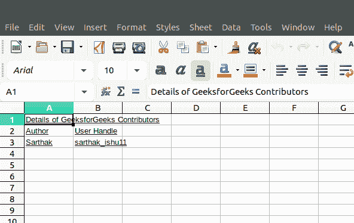
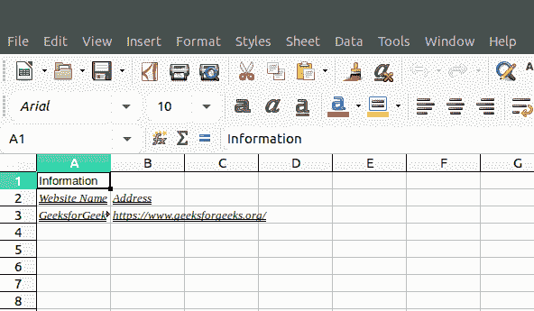

# PHP|Spreadsheet_Excel_Writer|setUnderline()函数

> Original: [https://www.geeksforgeeks.org/php-spreadsheet_excel_writer-setunderline-function/](https://www.geeksforgeeks.org/php-spreadsheet_excel_writer-setunderline-function/)

SetUnderline()函数是 PHP|Spreadsheet_Excel_Writer 中的内置函数，用于设置文本的下划线。

**语法：**

```php
*void* Format::setUnderline( $underline )
```

**参数：**此函数接受单个参数*$下划线*。 此参数的可能值为 1(单线)和 2(双线)。

**返回值：**此函数成功时返回 TRUE，失败时返回 PEAR_ERROR。

**示例 1：**

## PHP

```php
<?php
require_once 'Spreadsheet/Excel/Writer.php';

// Add Workbook
$workbook = new Spreadsheet_Excel_Writer();

// Add Format to spreadsheet
$format_italic =& $workbook->addFormat();

// Set Underline
$format_italic->setUnderline(1);

// Add Worksheet to Spreadsheet
$worksheet =& $workbook->addWorksheet();

// Write to Worksheet
$worksheet->write(0, 0, "Details of GeeksforGeeks
                    Contributors", $format_italic);
$worksheet->write(1, 0, "Author", $format_italic);
$worksheet->write(1, 1, "User Handle", $format_italic);
$worksheet->write(2, 0, "Sarthak", $format_italic);
$worksheet->write(2, 1, "sarthak_ishu11", $format_italic);

// Send .xlsx file to header
$workbook->send('test.xls');

// Close Workbook Object
$workbook->close();
?>
```

发帖主题：Re：Колибри0.7.0



**示例 2：**

## PHP

```php
<?php
require_once 'Spreadsheet/Excel/Writer.php';

// Create Spreadsheet_Excel_Writer Object
$workbook = new Spreadsheet_Excel_Writer();

// Add Worksheet
$worksheet =& $workbook->addWorksheet();

// Set Font Family Times New Roman
$format_setUnderline =& $workbook->addFormat();
$format_setUnderline->setFontFamily('Times New Roman');

// Set Italic Property
$format_setUnderline->setItalic();

// Set Underline to text
$format_setUnderline->setUnderline(2);

// Write to Worksheet
$worksheet->write(0, 0, "Information");
$worksheet->write(1, 0, "Website Name", $format_setUnderline);
$worksheet->write(1, 1, "Address", $format_setUnderline);
$worksheet->write(2, 0, "GeeksforGeeks", $format_setUnderline);
$worksheet->write(2, 1, "https://www.geeksforgeeks.org/",
                                 $format_setUnderline);
$workbook->send('test.xls');

$workbook->close();
?>
```

发帖主题：Re：Колибри0.7.0



**引用：**[https://pear.php.net/manual/en/package.fileformats.spreadsheet-excel-writer.spreadsheet-excel-writer-format.setunderline.php](https://pear.php.net/manual/en/package.fileformats.spreadsheet-excel-writer.spreadsheet-excel-writer-format.setunderline.php)