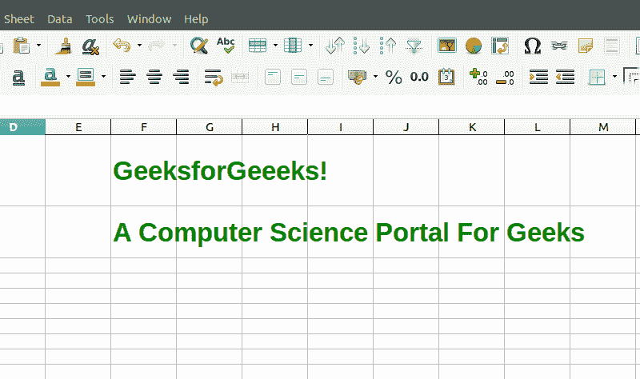
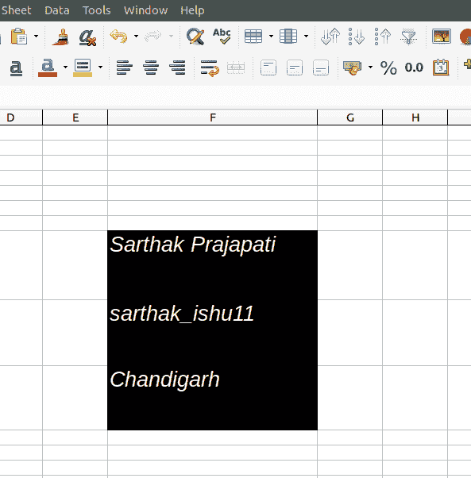

# PHP|Spreadsheet_Excel_Writer|setVAlign()函数

> Original: [https://www.geeksforgeeks.org/php-spreadsheet_excel_writer-setvalign-function/](https://www.geeksforgeeks.org/php-spreadsheet_excel_writer-setvalign-function/)

SetVAlign()函数是 Spreadsheet_Excel_Writer 中的内置函数，用于设置电子表格的单元格对齐方式。 这是**setAlign()**函数的替代方法。

**语法：**

```php
*void* Format::setVAlign( $location )
```

**参数：**此函数接受单个参数*$location*，该参数用于设置要将文本放置为‘top’、‘vCenter’、‘Bottom’、‘vjustate’、‘vequence_space’的位置。\

**返回值：**此函数成功时返回 TRUE，失败时返回 PEAR_ERROR。

**示例 1：**

## PHP

```php
<?php

// require_once 'Spreadsheet/Excel/Writer.php';

// Add object of class Spreadsheet_Excel_Writer
$workbook = new Spreadsheet_Excel_Writer();
$worksheet =& $workbook->addWorksheet();

// Add format to the workbook
$format_center =& $workbook->addFormat();

// Set color for the text
$format_center->setColor ('green');

// Set alignment of text to the center of the cell
$format_center->setVAlign('vcenter');

// Add boldness to the text
$format_center->setBold(1);

// Set size of the text
$format_center->setSize(25);

// Add data to the cell
$worksheet->write(0, 5, 'GeeksforGeeeks!', $format_center);
$worksheet->write(1, 5, 'A Computer Science Portal For Geeks', $format_center);

// Send file to the browser
$workbook->send('test.xlsx');

// Free the memory
$workbook->close();
?>
```

发帖主题：Re：Колибри0.7.0



**示例 2：**

## PHP

```php
<?php

require_once 'Spreadsheet/Excel/Writer.php';

// Add object of class Spreadsheet_Excel_Writer
$workbook = new Spreadsheet_Excel_Writer();
$worksheet =& $workbook->addWorksheet();

// Add Format to the workbook
$format_center =& $workbook->addFormat();

// Set Color for the text
$format_center->setColor ('white');

// Set Alignment of text to the top of the cell
$format_center->setVAlign('top');

// Set background color
$format_center->setBgColor('black');

// Set Pattern to the cell
$format_center->setPattern(1);

// Add Boldness to the text
$format_center->setItalic(1);

// Set Size of the text
$format_center->setSize(20);

// Add data to the cell
$worksheet->write(7, 5, 'Sarthak Prajapati', $format_center);
$worksheet->write(8, 5, 'sarthak_ishu11', $format_center);
$worksheet->write(9, 5, 'Chandigarh', $format_center);

// Send file to the browser
$workbook->send('test.xlsx');

// Free the memory
$workbook->close();
?>
```

发帖主题：Re：Колибри0.7.0



**引用：**[https://pear.php.net/manual/en/package.fileformats.spreadsheet-excel-writer.spreadsheet-excel-writer-format.setvalign.php](https://pear.php.net/manual/en/package.fileformats.spreadsheet-excel-writer.spreadsheet-excel-writer-format.setvalign.php)