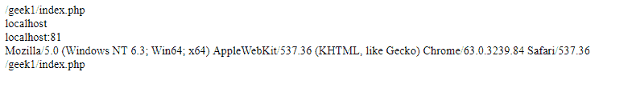
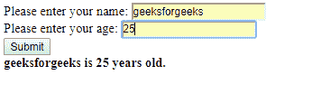

# PHP|超全局变量

> Original: [https://www.geeksforgeeks.org/php-superglobals/](https://www.geeksforgeeks.org/php-superglobals/)

我们已经在 POST[PHP|变量和数据类型](https://www.geeksforgeeks.org/php-variables-data-types/)中讨论了 PHP 中的变量和全局变量。 在本文中，我们将了解 PHP 中的*超全局变量*。

这些变量是 PHP 中专门定义的数组变量，使您可以轻松地获取有关请求或其上下文的信息。 超级全局变量在您的整个脚本中都可用。 这些变量可以从任何函数、类或任何文件访问，而无需执行任何特殊任务，如声明任何全局变量等。它们主要用于在应用程序中从一个页面到另一个页面等存储和获取信息。

以下是 PHP 中可用的超全局变量列表：

1.  $GLOBAL
2.  $_ 服务器
3.  申请
4.  $_GET
5.  __POST
6.  __ 会话 _
7.  $_cookie
8.  $_FILES
9.  $_ENV

现在让我们来详细了解一下其中一些超全球化现象：

*   **$globals**：它是一个超全局变量，用于从 PHP 脚本中的任何位置访问全局变量。 PHP 将所有全局变量存储在数组$globals[]中，其中 index 保存可以访问的全局变量名。
    下面的程序说明了$global 在 PHP 中的用法：

## PHP

```php
<?php
$x = 300;
$y = 200;

function multiplication(){
    $GLOBALS['z'] = $GLOBALS['x'] * $GLOBALS['y'];
}

multiplication();
echo $z;
?>
```

发帖主题：Re：Kolibrios

```php
60000
```

在上面的代码中，两个全局变量被声明为**$x**和**$y**，它们被赋予了一定的值。 然后定义函数**乘法()**，将**$x**和**$y**的值相乘，并存储在**全局数组**中定义的另一个变量**$z**中。

*   **$_server**：它是一个 PHP 超级全局变量，存储有关头文件、路径和脚本位置的信息。 其中一些元素用于从超级全局变量$_SERVER 获取信息。
    下面的程序说明了$_SERVER 在 PHP 中的用法：

## PHP

```php
<?php
echo $_SERVER['PHP_SELF'];
echo "<br>";
echo $_SERVER['SERVER_NAME'];
echo "<br>";
echo $_SERVER['HTTP_HOST'];
echo "<br>";
echo $_SERVER['HTTP_USER_AGENT'];
echo "<br>";
echo $_SERVER['SCRIPT_NAME'];
echo "<br>"
?>
```

发帖主题：Re：Kolibrios



在上面的代码中，我们使用$_SERVER 元素来获取一些信息。 我们使用‘php_self’元素获取当前的文件名。 然后，我们使用‘server_name’元素获取当前使用的服务器名称。 然后我们通过‘HTTP_HOST’获得主机名。

*   **$_REQUEST**：它是一个超全局变量，用于在提交 HTML 表单后收集数据。 $_REQUEST 不是最常用的，因为$_POST 和$_GET 执行相同的任务，并且使用广泛。
    下面是解释$_REQUEST 如何工作的 HTML 和 PHP 代码：

## 超文本标记语言

```php
<!DOCTYPE html>
<html>
<body>

<form method="post" action="<?php echo $_SERVER['PHP_SELF'];?>">
 NAME: <input type="text" name="fname">
 <button type="submit">SUBMIT</button>
</form>
<?php
if ($_SERVER["REQUEST_METHOD"] == "POST") {
    $name = htmlspecialchars($_REQUEST['fname']);
    if(empty($name)){
        echo "Name is empty";
    } else {
        echo $name;
    }
}
?>
</body>
</html>
```

发帖主题：Re：Kolibrios


在上面的代码中，我们创建了一个表单，该表单将名称作为用户的输入，并在单击 Submit 按钮时打印其名称。 我们使用 action 属性中指定的**$_server[‘PHP_Self’]**元素将表单中接受的数据传输到同一页，因为我们使用 PHP 代码操作同一页中的数据。 使用$_REQUEST 超全局数组变量检索数据

*   **$_POST**：它是一个超级全局变量，用于在提交 HTML 表单后收集数据。 当表单使用方法 POST 传输数据时，数据在查询字符串中不可见，因此在此方法中会保持安全级别。
    下面是解释$_POST 工作原理的 HTML 和 PHP 代码：

## 超文本标记语言

```php
<!DOCTYPE html>
<html>
<body>

<form method="post" action="<?php echo $_SERVER['PHP_SELF'];?>">
 <label for="name">Please enter your name: </label>
 <input name="name" type="text"><br>
 <label for="age">Please enter your age: </label>
 <input name="age" type="text"><br>
 <input type="submit" value="Submit">
 <button type="submit">SUBMIT</button>
</form>
<?php
$nm=$_POST['name'];
$age=$_POST['age'];
echo "<strong>".$nm." is $age years old.</strong>";
?>
</body>
</html>
```

发帖主题：Re：Kolibrios



在上面的代码中，我们创建了一个表单，该表单获取用户的姓名和年龄，并在用户提交数据时使用$_POST 超级全局变量访问数据。 因为每个超全局变量都是一个数组，所以它可以存储多个值。 因此，我们从$_POST 变量检索姓名和年龄，并将它们存储在$nm 和$age 变量中。

*   **$_get**：$_get 是一个超级全局变量，用于在提交 HTML 表单后收集数据。 当表单使用 GET 方法传输数据时，数据在查询字符串中可见，因此值不会隐藏。 $_GET 超级全局数组变量存储 URL 中的值。
    下面是解释$_GET 如何工作的 HTML 和 PHP 代码：

## 超文本标记语言

```php
<!DOCTYPE html>
<html>
<head>
<title></title>
</head>
<body bgcolor="cyan">   
    <?php
        $name = $_GET['name'];
        $city = $_GET['city'];
        echo "<h1>This is ".$name." of ".$city."</h1><br>";
    ?>
    
</body>
</html>
```

其实我们刚才看到了一半的逻辑。 在上面的代码中，我们创建了奈尼特湖的超链接图像，它将把我们带到 picture.php 页面，同时还将使用参数**name=“Nainilake”**和**City=“Nainital”**。
也就是说，当我们点击奈尼特湖的小图片时，我们将被带到下一页的 picture.php 以及参数。 因为默认方法是 GET，所以这些参数将使用 GET 方法传递到下一页，并且它们将在地址栏中可见。 当我们想要将值传递到某个地址时，它们会使用问号(？)附加到该地址。

这里，参数**name=Nainilake**被附加到地址。 如果我们想添加更多的值，可以在每个键-值对之后使用与符号(&)添加它们，类似于在 name 参数后面使用与号添加**City=Nainital**。 现在，在单击奈尼特湖的图像后，我们希望显示 picture.php 页面，同时显示参数值。