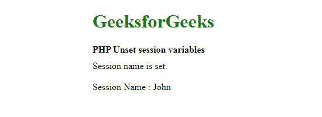
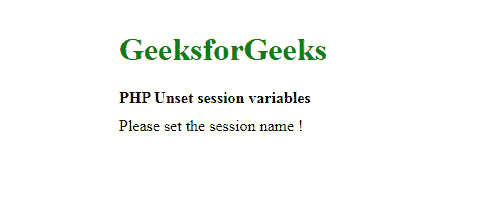
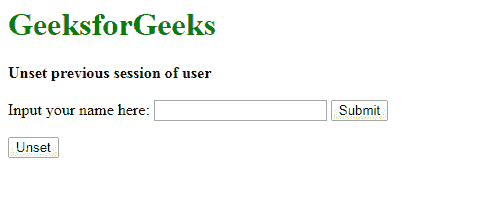

# PHP|未设置会话变量

> Original: [https://www.geeksforgeeks.org/php-unset-session-variable/](https://www.geeksforgeeks.org/php-unset-session-variable/)

无论何时使用 Cookie 存储数据，黑客都有可能在用户的计算机中插入一些有害数据，从而损害任何应用程序。 因此，使用 PHP 会话在服务器上存储信息比在计算机上存储信息总是明智的。 每当网站或应用程序的多个页面需要数据时，都会使用 PHP**Session**。

此**会话**在存储注册变量及其值的文件夹中创建一个临时文件，这些变量可供整个网站使用。 当用户从站点或浏览器注销时，此**会话**结束。 每个不同的用户都会被赋予唯一的会话 ID，这些 ID 链接到个人的帖子或电子邮件。

```php
<?php
  session_start();
  echo session_id();
?>
```

**注意：**会话 ID 是由 PHP 引擎随机生成的，难以辨别。

**示例：**每当在某些代码中使用**$_session**时，下面的 PHP 函数注销或清除会话变量。 它主要用于销毁单个会话变量。

*   **语法：**

    ```php
      unset($_SESSION['variable_name']);

    ```

*   **程序 1：**

    ```php
    <!DOCTYPE html>
    <html>

    <head>
        <style>
            body {
                width: 450px;
                height: 300px;
                margin: 10px;
                float: left;
            }

            .height {
                height: 10px;
            }
        </style>
    </head>

    <body>
        <h1 style="color:green">GeeksforGeeks</h1>
        <b> PHP Unset session variables </b>
        <div class="height"> </div>
    <?php

    // start a new session 
    session_start(); 

    // Check if the session name exists 
    if( isset($_SESSION['name']) ) { 
        echo 'Session name is set.'.'<br>'; 
    } 
    else { 
        echo 'Please set the session name !'.'<br>'; 
    } 
     echo'<br>';
     $_SESSION['name'] = 'John'; 

      //unset($_SESSION['name']);     
     echo "Session Name : ".$_SESSION['name'].'<br>'; 

    ?> 
    </body>
    </html>
    ```

*   **输出：**当我们对**unset($_SESSION[‘name’])**进行注释时，您会得到以下输出。
    

**注意：**PHP**session_start()**函数总是写在任何代码的开头。

*   当我们执行**unset($_SESSION[‘name’])**时，通过取消注释示例程序中所需的行，您将获得以下输出。

    ```php
      unset($_SESSION['name']);      
      //echo "Session Name : ".$_SESSION['name'];  

    ```

*   **输出：**
    
*   如果要销毁所有会话变量，请使用以下 PHP 函数。

    ```php
    session_destroy();
    ```

*   如果您想要清除或释放会话变量占用的空间以用于其他用途，可以使用以下 PHP 函数。

    ```php
    session_unset();
    ```

*   **程序 2：**

    ```php
    <!DOCTYPE html>
    <html>

    <head>
        <title>Unset Session Variable </title>
    </head>

    <body>
        <h1 style="color:green">GeeksforGeeks</h1>
        <b> Unset previous session of user</b>
        <?php
         echo '<br>';
         echo '<br>';
         if(isset($_SESSION["user_name"]))
         { echo "Welcome "; echo $_SESSION["user_name"]; }
        ?>
            <form>
                Input your name here:
                <input type="text" id="user_id" name="user_id">
                <input type=submit value=Submit>
            </form>
            <form action="#">
                <input type="submit" name="submit"
                       value="Unset"
                       onclick="UnsetPreviousSession()">
            </form>
        <?php 

        session_start();

        if(!isset($_SESSION["user_name"]) && (!empty($_GET['user_id'])))
        {
            $_SESSION["user_name"] = $_GET["user_id"];
        }
        else
        { 
            UnsetPreviousSession();
        }
        function UnsetPreviousSession()
        {
           unset($_SESSION['user_name']); 
        }
        ?>
    </body>

    </html>
    ```

*   **输出：**点击**取消设置**按钮后，可看到以下输出屏幕供重新输入，显示先前的会话变量未设置。
    