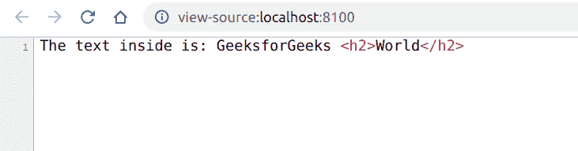

# PHP|XMLReader readInnerXml()函数

> Original: [https://www.geeksforgeeks.org/php-xmlreader-readinnerxml-function/](https://www.geeksforgeeks.org/php-xmlreader-readinnerxml-function/)

**XMLReader：：readInnerXml()函数**是 PHP 中的一个内置函数，用于读取当前节点的内容，包括子节点和标记。

**语法：**

```
*string* XMLReader::readInnerXml( *void* )
```

**参数：**此函数不接受任何参数。

**返回值：**如果失败，此函数以字符串或空字符串的形式返回当前节点的内容。

下面的示例说明了 PHP 中的**XMLReader：：readInnerXml()函数**：

**示例 1：**在本程序中，我们将读取没有子节点的元素的值。

*   **data.xml**

    ```
    <?xml version="1.0" encoding="utf-8"?>
    <div>
        <h1> Hello World </h1>
    </div>
    ```

*   **index.php**

    ```
    <?php

    // Create a new XMLReader instance
    $XMLReader = new XMLReader();

    // Open the XML file
    $XMLReader->open('data.xml');

    // Iterate through the XML nodes to
    // reach the h1 element
    $XMLReader->read();
    $XMLReader->read();
    $XMLReader->read();

    // Print the XML content
    echo "The text inside is:" 
        . $XMLReader->readInnerXml();
    ?>
    ```

*   发帖主题：Re：Колибри0.7.8.0

**示例 2：**在本程序中，我们将读取带有子节点的元素的值。

*   **data.xml**

    ```
    <?xml version="1.0" encoding="utf-8"?>
    <div>
        <h1> GeeksforGeeks <h2>World</h2></h1>
    </div>
    ```

*   **index.php**

    ```
    <?php

    // Create a new XMLReader instance
    $XMLReader = new XMLReader();

    // Open the XML file
    $XMLReader->open('data.xml');

    // Iterate through the XML nodes to
    // reach the h1 element
    $XMLReader->read();
    $XMLReader->read();
    $XMLReader->read();

    // Print the XML content
    echo "The text inside is:" .
        $XMLReader->readInnerXml();
    ?>
    ```

*   **输出：**
    

**引用：**[https://www.php.net/manual/en/xmlreader.readinnerxml.php](https://www.php.net/manual/en/xmlreader.readinnerxml.php)