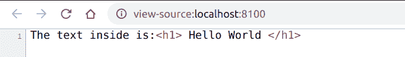
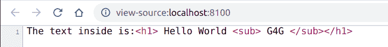

# PHP|XMLReader readOuterXml()函数

> Original: [https://www.geeksforgeeks.org/php-xmlreader-readouterxml-function/](https://www.geeksforgeeks.org/php-xmlreader-readouterxml-function/)

**XMLReader：：readOuterXml()函数**是 PHP 中的一个内置函数，用于读取当前节点的内容，包括节点本身。

**语法：**

```php
*string* XMLReader::readOuterXml( *void* )
```

**参数：**此函数不接受任何参数。

**返回值：**此函数在失败时以字符串或空字符串的形式返回当前节点的内容(包括自身)。

下面的示例说明了 PHP 中的**XMLReader：：readOuterXml()函数**：

**示例 1：**在本程序中，我们将读取没有子节点的元素的值。

*   **data.xml**

    ```php
    <?xml version="1.0" encoding="utf-8"?>
    <div>
        <h1>Hello World</h1>
    </div>
    ```

*   **index.php**

    ```php
    <?php

    // Create a new XMLReader instance
    $XMLReader = new XMLReader();

    // Open the XML file
    $XMLReader->open('data.xml');

    // Iterate through the XML nodes to
    // reach the h1 element
    $XMLReader->read();
    $XMLReader->read();
    $XMLReader->read();

    // Print the XML content
    // Here it will include itself,
    // <h1> tags also
    echo "The text inside is:" . 
        $XMLReader->readOuterXml();
    ?>
    ```

*   **输出：**
    

**示例 2：**在本程序中，我们将读取带有子节点的元素的值。

*   **data.xml**

    ```php
    <?xml version="1.0" encoding="utf-8"?>
    <div>
        <h1>Hello World 
          <sub>G4G</sub>
        </h1>
    </div>
    ```

*   **index.php**

    ```php
    <?php

    // Create a new XMLReader instance
    $XMLReader = new XMLReader();

    // Open the XML file
    $XMLReader->open('data.xml');

    // Iterate through the XML nodes to
    // reach the h1 element
    $XMLReader->read();
    $XMLReader->read();
    $XMLReader->read();

    // Print the XML content
    echo "The text inside is:" . 
        $XMLReader->readOuterXml();
    ?>
    ```

*   **输出：**
    

**引用：**[https://www.php.net/manual/en/xmlreader.readouterxml.php](https://www.php.net/manual/en/xmlreader.readouterxml.php)