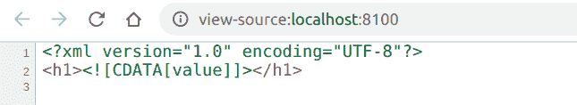

# PHP|XMLWriter endCdata()函数

> Original: [https://www.geeksforgeeks.org/php-xmlwriter-endcdata-function/](https://www.geeksforgeeks.org/php-xmlwriter-endcdata-function/)

**XMLWriter：：endCdata()函数**是 PHP 中的一个内置函数，用于结束当前 CDATA。 CDATA 是不被解析器解析但被识别为标记的文本块。

**语法：**

```
*bool* XMLWriter::endCdata( *void* )
```

**参数：**此函数不接受任何参数。

**返回值：**此函数成功时返回 TRUE，失败时返回 FALSE。

下面的示例演示了 PHP 中的**XMLWriter：：endCdata()函数**：

**示例 1：**

```
<?php

// Create a new XMLWriter instance
$writer = new XMLWriter();

// Create the output stream as PHP
$writer->openURI('php://output');

// Start the document
$writer->startDocument('1.0', 'UTF-8');

// Start a element
$writer->startElement('h1');

// Start the Cdata
$writer->startCdata();

// Add value to the Cdata
$writer->text('value');

// End the Cdata
$writer->endCdata();

// End the element
$writer->endElement();

// End the document
$writer->endDocument();
?>
```

**输出：**


**示例 2：**

```
<?php

// Create a new XMLWriter instance
$writer = new XMLWriter();

// Create the output stream as PHP
$writer->openURI('php://output');

// Start the document
$writer->startDocument('1.0', 'UTF-8');

// Start a element
$writer->startElement('p');

// Start the Cdata
$writer->startCdata();

// Add value to the Cdata
$writer->text('This will be secret '
    . ' text, not visible in browser');

// End the Cdata
$writer->endCdata();

// Add value to the element
$writer->text('GeeksforGeeks');

// End the element
$writer->endElement();

// End the document
$writer->endDocument();
?>
```

发帖主题：Re：Колибри0.7.0

```
<?xml version="1.0" encoding="UTF-8"?>
<p><![CDATA[This will be secret text, not visible in browser]]>GeeksforGeeks</p>
```

**引用：**[https://www.php.net/manual/en/function.xmlwriter-end-cdata.php](https://www.php.net/manual/en/function.xmlwriter-end-cdata.php)