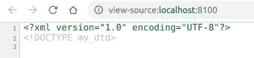

# PHP|XMLWriter endDtd()函数

> Original: [https://www.geeksforgeeks.org/php-xmlwriter-enddtd-function/](https://www.geeksforgeeks.org/php-xmlwriter-enddtd-function/)

**XMLWriter：：endDtd()函数**是 PHP 中的一个内置函数，用于结束使用*XMLWriter：：startDtd()*函数启动的当前 DTD。 DTD 是 Document Type Definition 的缩写，它定义了 XML 文档的结构、合法元素和属性。 DTD 在网页中不可见，因为它们的行为类似于注释。

**语法：**

```
*bool* XMLWriter::endDtd( *void* )
```

**参数：**此函数不接受任何参数。

**返回值：**此函数成功时返回 TRUE，失败时返回 FALSE。

下面的示例说明了 PHP 中的**XMLWriter：：endDtd()函数**：

**示例 1：**

```
<?php

// Create a new XMLWriter instance
$writer = new XMLWriter();

// Create the output stream as PHP
$writer->openURI('php://output');

// Start the document
$writer->startDocument('1.0', 'UTF-8');

// Start the Dtd
$writer->startDtd('my_dtd');

// End the Dtd 
$writer->endDtd();

// End the document
$writer->endDocument();
?>
```

**输出：**按 Ctrl+U 查看 XML


**示例 2：**

```
<?php
// Create a new XMLWriter instance
$writer = new XMLWriter();

// Create the output stream as PHP
$writer->openURI('php://output');

// Start the document
$writer->startDocument('1.0', 'UTF-8');

// Start the Dtd
$writer->startDtd('my_dtd_which_is_not_visible');

// End the Dtd 
$writer->endDtd();

// Write a text to document
$writer->text('This is XMLWriter.');

// End the document
$writer->endDocument();
?>
```

发帖主题：Re：Колибри0.7.0

```
This is XMLWriter.
```

**引用：**[https://www.php.net/manual/en/function.xmlwriter-end-dtd.php](https://www.php.net/manual/en/function.xmlwriter-end-dtd.php)