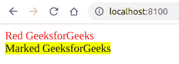

# PHP|XMLWriter endElement()函数

> Original: [https://www.geeksforgeeks.org/php-xmlwriter-endelement-function/](https://www.geeksforgeeks.org/php-xmlwriter-endelement-function/)

**XMLWriter：：endElement()函数**是 PHP 中的一个内置函数，用于结束使用*XMLWriter：：startElement()*函数启动的当前元素。

**语法：**

```php
*bool* XMLWriter::endElement( *void* )
```

**参数：**此函数不接受任何参数。

**返回值：**此函数成功时返回 TRUE，失败时返回 FALSE。

下面的示例说明了 PHP 中的**XMLWriter：：endElement()函数**：

**示例 1：**

```php
<?php

// Create a new XMLWriter instance
$writer = new XMLWriter();

// Create the output stream as PHP
$writer->openURI('php://output');

// Start the document
$writer->startDocument('1.0', 'UTF-8');

// Start a element
$writer->startElement('strong');

// Add value to the element
$writer->text('GeeksforGeeks in bold.');

// End the element
$writer->endElement();

// End the document
$writer->endDocument();
?>
```

发帖主题：Re：Колибри0.7.0

```php
GeeksforGeeks in bold.
```

**示例 2：**

```php
<?php

// Create a new XMLWriter instance
$writer = new XMLWriter();

// Create the output stream as PHP
$writer->openURI('php://output');

// Start the document
$writer->startDocument('1.0', 'UTF-8');

// Start a element
$writer->startElement('div');

// Write the attribute
$writer->writeAttribute('style', 'color:red');

// Add value to the element
$writer->text('Red GeeksforGeeks');

// End the element
$writer->endElement();

// Start a element
$writer->startElement('mark');

// Add value to the element
$writer->text('Marked GeeksforGeeks');

// End the element
$writer->endElement();

// End the document
$writer->endDocument();
?>
```

**输出：**


**引用：**[https://www.php.net/manual/en/function.xmlwriter-end-element.php](https://www.php.net/manual/en/function.xmlwriter-end-element.php)