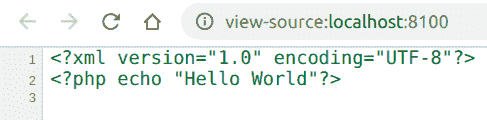

# PHP|XMLWriter endPI()函数

> Original: [https://www.geeksforgeeks.org/php-xmlwriter-endpi-function/](https://www.geeksforgeeks.org/php-xmlwriter-endpi-function/)

**XMLWriter：：endPI()函数**是 PHP 中的一个内置函数，用于结束使用**XMLWriter：：startPI()**函数启动的当前 PI。 处理指令(PI)允许文档包含指令，这些指令不是文档字符数据的一部分，但会传递给 XML。 PI 在网页中不可见，其行为类似于评论。

**语法：**

```
*bool* XMLWriter::endPi( *void* )
```

**参数：**此函数不接受任何参数。

**返回值：**此函数成功时返回 TRUE，失败时返回 FALSE。

下面的示例说明了 PHP 中的**XMLWriter：：endPI()函数**：

**示例 1：**

```
<?php

// Create a new XMLWriter instance
$writer = new XMLWriter();

// Create the output stream as PHP
$writer->openURI('php://output');

// Start the document
$writer->startDocument('1.0', 'UTF-8');

// Start the Pi
$writer->startPi('php');

// Write the instruction
$writer->text('echo $a;');

// End the Pi
$writer->endPi();

// End the document
$writer->endDocument();
?>
```

**输出：**


**示例 2：**

```
<?php

// Create a new XMLWriter instance
$writer = new XMLWriter();

// Create the output stream as PHP
$writer->openURI('php://output');

// Start the document
$writer->startDocument('1.0', 'UTF-8');

// Start the Pi which is not visible
$writer->startPi('xml-stylesheet');

// End the Pi
$writer->endPi();

// Start a element
$writer->startElement('p');

// Add value to the element
$writer->text('GeeksforGeeks');

// End the element
$writer->endElement();

// End the document
$writer->endDocument();
?>
```

发帖主题：Re：Колибри0.7.0

```
GeeksforGeeks
```

**引用：**[https://www.php.net/manual/en/function.xmlwriter-end-pi.php](https://www.php.net/manual/en/function.xmlwriter-end-pi.php)