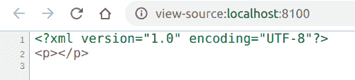
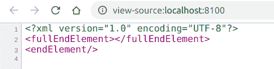

# PHP|XMLWriter fullEndElement()函数

> Original: [https://www.geeksforgeeks.org/php-xmlwriter-fullendelement-function/](https://www.geeksforgeeks.org/php-xmlwriter-fullendelement-function/)

**XMLWriter：：fullEndElement()函数**是 PHP 中的一个内置函数，用于结束使用 XMLWriter：：startElement()函数启动的当前元素。 *endElement()*函数和*fullEndElement()*函数的不同之处在于，前者在元素为空的情况下向同一元素添加反斜杠，而后者创建单独的结束元素。

**语法：**

```
*bool* XMLWriter::fullEndElement( *void* )
```

**参数：**此函数不接受任何参数。

**返回值：**此函数成功时返回 TRUE，失败时返回 FALSE。

下面的示例说明了 PHP 中的**XMLWriter：：fullEndElement()函数**：

**示例 1：**

```
<?php

// Create a new XMLWriter instance
$writer = new XMLWriter();

// Create the output stream as PHP
$writer->openURI('php://output');

// Start the document
$writer->startDocument('1.0', 'UTF-8');

// Start a element
$writer->startElement('p');

// End the element
$writer->fullEndElement();

// End the document
$writer->endDocument();
?>
```

**输出：**


**示例 2：**在本程序中，我们将比较*endElement(*)和*fullEndElement()*函数

```
<?php

// Create a new XMLWriter instance
$writer = new XMLWriter();

// Create the output stream as PHP
$writer->openURI('php://output');

// Start the document
$writer->startDocument('1.0', 'UTF-8');

// Set the indent
$writer->setIndent(true);

// Start a element
$writer->startElement('fullEndElement');

// End the element
$writer->fullEndElement();

// Start a element
$writer->startElement('endElement');

// End the element
$writer->endElement();

// End the document
$writer->endDocument();
?>
```

**输出：**


**引用：**[https://www.php.net/manual/en/function.xmlwriter-full-end-element.php](https://www.php.net/manual/en/function.xmlwriter-full-end-element.php)