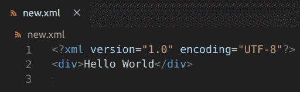

# PHP|XMLWriter openUri()函数

> Original: [https://www.geeksforgeeks.org/php-xmlwriter-openuri-function/](https://www.geeksforgeeks.org/php-xmlwriter-openuri-function/)

**XMLWriter：：openUri()函数**是 PHP 中的一个内置函数，用于使用源 URI 创建一个新的 XMLWriter 进行输出。 简而言之，此函数决定如何将 XML 输出给用户，可以通过浏览器输出，也可以直接输出到文件。

**语法：**

```php
*bool* XMLWriter::openUri( *string* $uri )
```

**参数：**此函数接受单个参数**$uri**，该参数保存输出的 uri。

**返回值：**此函数成功时返回 TRUE，失败时返回 FALSE。

下面的示例说明了 PHP 中的**XMLWriter：：openUri()函数**：

**示例 1：**

```php
<?php

// Create a new XMLWriter instance
$writer = new XMLWriter();

// Create the output stream as PHP
$writer->openURI('php://output');

// Start the document
$writer->startDocument('1.0', 'UTF-8');

// Start a element
$writer->startElement('i');

// Add value to the element
$writer->text('GeeksforGeeks');

// End the element
$writer->endElement();

// End the document
$writer->endDocument();
?>
```

发帖主题：Re：Колибри0.7.0

```php
*GeeksforGeeks*
```

**示例 2：**

```php
<?php

// Create a new XMLWriter instance
$writer = new XMLWriter();

// Create the output stream to a file
$writer->openURI('new.xml');

// Start the document
$writer->startDocument('1.0', 'UTF-8');

// Start a element
$writer->startElement('div');

// Add value to the element
$writer->text('Hello World');

// End the element
$writer->endElement();

// End the document
$writer->endDocument();
?>
```

**输出：**这将在同一文件夹中创建名为**new.xml**的新文件，其中包含以下内容


**引用：**[https://www.php.net/manual/en/function.xmlwriter-open-uri.php](https://www.php.net/manual/en/function.xmlwriter-open-uri.php)