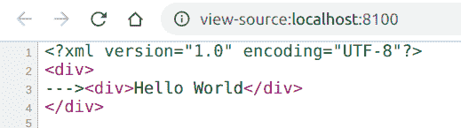
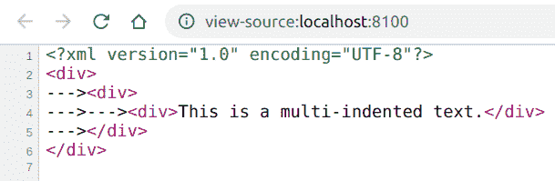

# PHP|XMLWriter setIndentString()函数

> Original: [https://www.geeksforgeeks.org/php-xmlwriter-setindentstring-function/](https://www.geeksforgeeks.org/php-xmlwriter-setindentstring-function/)

**XMLWriter：：setIndentString()函数**是 PHP 中的一个内置函数，用于设置字符串，该字符串将用于缩进结果 XML 的每个元素/属性。

**语法：**

```php
*bool* XMLWriter::setIndentString( *string* $indentString )
```

**参数：**此函数接受单个参数**$indentString**，该参数保存要用作缩进的字符串。

**返回值：**此函数成功时返回 TRUE，失败时返回 FALSE。

下面的示例说明 PHP 中的**XMLWriter：：setIndentString()函数**：

**示例 1：**

```php
<?php

// Create a new XMLWriter instance
$writer = new XMLWriter();

// Create the output stream as PHP
$writer->openURI('php://output');

// Start the document
$writer->startDocument('1.0', 'UTF-8');

// Enable the indents
$writer->setIndent(true);

// Set the indent string
$writer->setIndentString('--->');

// Start a element
$writer->startElement('div');

// Start a element
$writer->startElement('div');

// Add value to the element
$writer->text('Hello World');

// End the element
$writer->endElement();

// End the element
$writer->endElement();

// End the document
$writer->endDocument();
?>
```

**输出：**按 Ctrl+U 查看 XML


**示例 2：**

```php
<?php

// Create a new XMLWriter instance
$writer = new XMLWriter();

// Create the output stream as PHP
$writer->openURI('php://output');

// Start the document
$writer->startDocument('1.0', 'UTF-8');

// Enable the indents
$writer->setIndent(true);

// Set the indent string
$writer->setIndentString('--->');

// Start a element
$writer->startElement('div');

// Start a element
$writer->startElement('div');

// Start a element
$writer->startElement('div');

// Add value to the element
$writer->text('This is a multi-indented text.');

// End the element
$writer->endElement();

// End the element
$writer->endElement();

// End the element
$writer->endElement();

// End the document
$writer->endDocument();
?>
```

**输出：**


**引用：**[https://www.php.net/manual/en/function.xmlwriter-set-indent-string.php](https://www.php.net/manual/en/function.xmlwriter-set-indent-string.php)