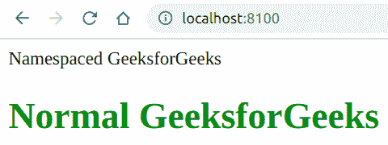

# PHP|XMLWriter startAttributeNS()函数

> Original: [https://www.geeksforgeeks.org/php-xmlwriter-startattributens-function/](https://www.geeksforgeeks.org/php-xmlwriter-startattributens-function/)

**XMLWriter：：startAttributens()函数**是 PHP 中的一个内置函数，用于启动命名空间属性。 稍后可以使用**XMLWriter：：endAttribute()**函数关闭该属性。 通常，网页样式在名称空间属性中不起作用。

**语法：**

```
*bool* XMLWriter::startAttributeNs( *string* $prefix, 
*string* $name, *string* $uri )
```

**参数：**此函数接受上述三个参数，如下所述：

*   **$prefix：**它指定命名空间的前缀。
*   **$name：**它指定命名空间的名称。
*   **$uri：**它指定命名空间的值。

**返回值：**此函数成功时返回 TRUE，失败时返回 FALSE。

下面的示例说明了 PHP 中的**XMLWriter：：startAttributeNS()函数**：

**示例 1：**

```
<?php

// Create a new XMLWriter instance
$writer = new XMLWriter();

// Create the output stream as PHP
$writer->openURI('php://output');

// Start the document
$writer->startDocument('1.0', 'UTF-8');

// Start a element
$writer->startElement('div');

// Start the namespaced attribute
$writer->startAttributeNs('pre', 'attrib', 'value');

// Add value to the attribute
$writer->text('value');

// End the attribute
$writer->endAttribute();

// End the element
$writer->endElement();

// End the document
$writer->endDocument();
?>
```

发帖主题：Re：Колибри0.7.0

```
<?xml version="1.0" encoding="UTF-8"?>
<div pre:attrib="value" xmlns:pre="value"/>
```

**示例 2：**

```
<?php

// Create a new XMLWriter instance
$writer = new XMLWriter();

// Create the output stream as PHP
$writer->openURI('php://output');

// Start the document
$writer->startDocument('1.0', 'UTF-8');

// Start a element
$writer->startElement('div');

// Start the namespaced attribute with style attribute
// This will not work because it is namespaced
$writer->startAttributeNs('style', 'attrib', 'value');

// Add value to the attribute
$writer->text('color:blue');

// End the attribute
$writer->endAttribute();

// Add value to the element
$writer->text('Namespaced GeeksforGeeks');

// End the element
$writer->endElement();

// Start a h1 element
$writer->startElement('h1');

// Start the style attribute
$writer->startAttribute('style');

// Add value to the attribute
$writer->text('color:green');

// End the attribute
$writer->endAttribute();

// Add value to the element
$writer->text('Normal GeeksforGeeks');

// End the element
$writer->endElement();

// End the document
$writer->endDocument();
?>
```

**输出：**


**引用：**[https://www.php.net/manual/en/function.xmlwriter-start-attribute-ns.php](https://www.php.net/manual/en/function.xmlwriter-start-attribute-ns.php)