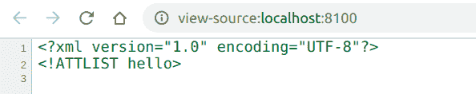

# PHP|XMLWriter startDtdAttlist()函数

> Original: [https://www.geeksforgeeks.org/php-xmlwriter-startdtdattlist-function/](https://www.geeksforgeeks.org/php-xmlwriter-startdtdattlist-function/)

**XMLWriter：：startDtdAttlist()函数**是 PHP 中的内置函数，用于启动 DTD AttList。 DTD 是 Document Type Definition 的缩写，它定义了 XML 文档的结构、合法元素和属性。 在 DTD 中，属性是用 ATTLIST 声明声明的。

**语法：**

```php
*bool* XMLWriter::startDtdAttlist( *string* $name )
```

**参数：**此函数接受保存属性列表名称的单个参数**$name**。

**返回值：**此函数成功时返回 TRUE，失败时返回 FALSE。

下面的示例说明了 PHP 中的**XMLWriter：：startDtdAttlist()函数**：

**示例 1：**

```php
<?php

// Create a new XMLWriter instance
$writer = new XMLWriter();

// Create the output stream as PHP
$writer->openURI('php://output');

// Start the document
$writer->startDocument('1.0', 'UTF-8');

// Start the Dtd Attlist
$writer->startDtdAttlist('hello');

// End the Dtd Attlist
$writer->endDtdAttlist();

// End the document
$writer->endDocument();
?>
```

**输出：**按 Ctrl+U 查看 XML


**示例 2：**

```php
<?php

// Create a new XMLWriter instance
$writer = new XMLWriter();

// Create the output stream as PHP
$writer->openURI('php://output');

// Start the document
$writer->startDocument('1.0', 'UTF-8');

// Start the Dtd Attlist
$writer->startDtdAttlist(
    'This_is_not_visible_in_webpage');

// End the Dtd Attlist
$writer->endDtdAttlist();

// Add text to the document
$writer->text('GeeksforGeeks');

// End the document
$writer->endDocument();
?>
```

发帖主题：Re：Колибри0.7.0

```php
GeeksforGeeks
```

**引用：**[https://www.php.net/manual/en/function.xmlwriter-start-dtd-attlist.php](https://www.php.net/manual/en/function.xmlwriter-start-dtd-attlist.php)