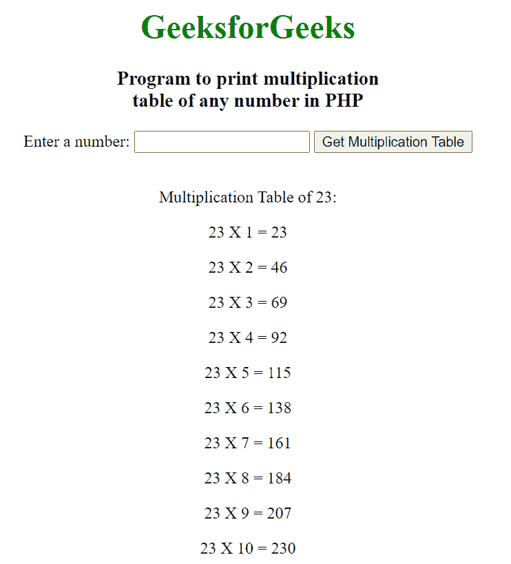

# 使用 PHP 打印任意数字乘法表的程序

> 原文:[https://www . geeksforgeeks . org/program-to-print-乘法-php 中的任意数字表/](https://www.geeksforgeeks.org/program-to-print-multiplication-table-of-any-number-in-php/)

在本文中，我们将看到如何使用 PHP 打印任意给定数字的乘法表。要制作乘法表，首先我们从用户那里得到一个数字输入，然后用 for 循环来显示乘法表。

我们用 HTML 和 PHP 来显示乘法表。HTML 部分用于设计表单以获取用户的输入，PHP 部分用于执行乘法并以表格格式显示结果。

**示例:**

## 服务器端编程语言（Professional Hypertext Preprocessor 的缩写）

```phphtml
<!DOCTYPE html>
<html>

<body>
    <center>
        <h1 style="color: green;">
            GeeksforGeeks
        </h1>

        <h3>
            Program to print multiplication<br>
            table of any number in PHP
        </h3>

        <form method="POST">
            Enter a number: 
            <input type="text" name="number">

            <input type="Submit" 
                value="Get Multiplication Table">
        </form>
    </center>
</body>

</html>

<?php
if($_POST) {
    $num = $_POST["number"];

    echo nl2br("<p style='text-align: center;'>
        Multiplication Table of $num: </p>
    ");

    for ($i = 1; $i <= 10; $i++) {
        echo ("<p style='text-align: center;'>$num"
            . " X " . "$i" . " = " 
            . $num * $i . "</p>
        ");
    }
}
?>
```

**输出:**

