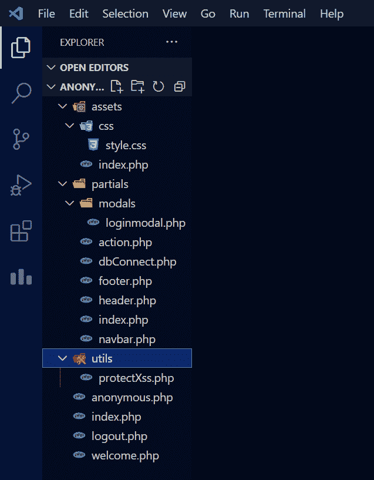
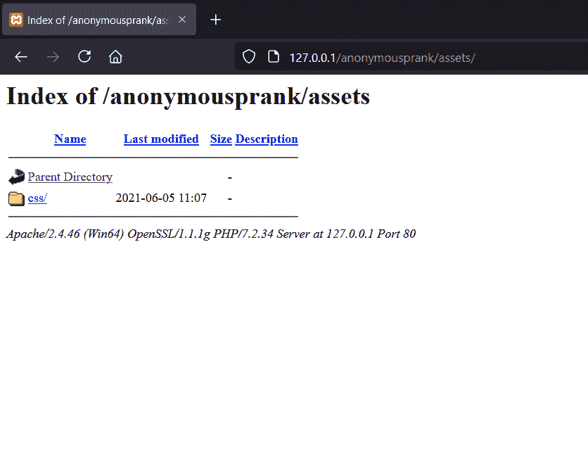
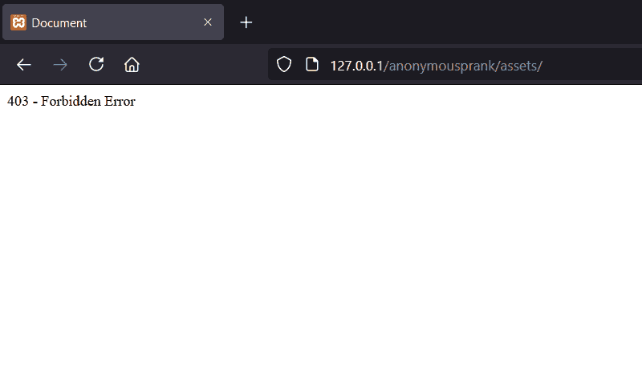
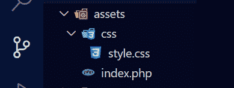
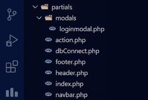
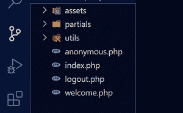

# 项目创意|PHP 匿名消息恶作剧游戏

> Original: [https://www.geeksforgeeks.org/project-idea-anonymous-message-prank-game-in-php/](https://www.geeksforgeeks.org/project-idea-anonymous-message-prank-game-in-php/)

在这篇文章中，我们将学习数据库的概念，如何使用 PHP 和 MySQL 制作一个简单的游戏，我们如何实现一个为特定用户发送秘密消息的数据库，如何在数据库中安排表，以及我们如何才能将我们的 Web 应用程序从这些安全问题中拯救出来。

**域：**使用 PHP 和 MySQL 数据库的 Web 应用程序。

**功能：**

*   注册
*   登录（电脑系统）
*   使用注册用户提供的 URL 向特定用户发送秘密消息
*   通过 Ajax 请求发送消息
*   数据库

这是一个简单的游戏，用户通过链接为特定用户发送秘密消息。 通过这个游戏，我们学到了很多东西，比如如何通过创建会话和销毁会话来注册和登录用户，如何在数据库中存储用户的数据和为他的名字创建了链接的特定用户的秘密消息。

**工具和技术：**

**前端：**

1.  引导 CDN
2.  HTML 和 CSS

**后端：**

1.  PHP
2.  JQuery
3.  数据库♥mysql

**工具：**

1.  XAMP 服务器(用于在本地主机上创建服务器)

**项目实施：**根据此文件结构创建空文件夹并创建文件



文件结构

**Assets 文件夹：**首先，让我们从 Assets 文件夹开始。 因此，我们创建此文件夹是因为我们在项目中使用的资产，如图像、视频、全局 CSS 和附加到项目中所有文件的 js 文件。 我们还为所有文件夹创建了一个 index.php 文件，因为如果有人试图访问此文件夹，则他只能看到索引页，而不是我们的目录

如果未创建 index.php 文件，则任何人都可以看到整个项目的文件结构



如果未在所有文件夹中创建 index.php



在所有文件夹中创建 index.php 之后



资产

## PHP

```php
<!-- filename - assets/index.php -->

<!DOCTYPE html>
<html lang="en">
<head>
    <meta charset="UTF-8">
    <meta http-equiv="X-UA-Compatible" content="IE=edge">
    <meta name="viewport" content=
        "width=device-width, initial-scale=1.0">
    <title>Error</title>
</head>
<body>
    403 - Forbidden Error
</body>
</html>
```

## 超文本标记语言

```php
<!-- filename - assets/css/style.css -->

.content {
  min-height: calc(93vh - 70px);
}
.footer {
  background-color: black;
  color: white;
  text-align: center;
  height: 40px;
}

.cont{
  height: 300px;
  overflow-y: auto;
}
```

**Utils Folder-将文件名设置为 ProtectXss.php-**此文件主要用于保护我们的 Web 应用程序免受跨站点脚本攻击。

## PHP

```php
<?php
  function protectxss($string) {
    $string=iconv(mb_detect_encoding(
          $string, mb_detect_order(), true),
        "UTF-8", $string
    );
    $string=addcslashes($string,"'");
    $string=addcslashes($string,'"');
    return htmlspecialchars($string);
}
?>
```

**Partials 文件夹，根据文件结构制作文件，如图：**



分词

在 Partials 文件夹中创建一个名为 modals 的文件夹，以在其中放置所有情态动词

源代码

## PHP

```php
<?php
// Filename partials/action.php

// Including all necessary files  
include "dbConnect.php";
include "../utils/protectXss.php";

// Signup handler for storing only names of users
if (isset($_POST['startBtn'])) {
    $name=protectxss($_POST['name']);
    $trimname=trim($name);
    $strreplace=str_replace(" ","_",$trimname);

    // Assigning them username and password
    $userName=$strreplace."@".time();
    $password = rand();

    // Converting to hash format
    $passhash=password_hash($password,PASSWORD_DEFAULT);
    $sql="INSERT INTO `an_users` (`an_id`, `an_name`,
        `an_username`, `an_password`, `timestamp`)
        VALUES (NULL, '$trimname', '$userName',
        '$passhash', current_timestamp())";

    $result=mysqli_query($conn,$sql);

    if ($result) {

        // Creating a session for a user
        session_start();
        $_SESSION['loggedinUser']=$userName;
        $_SESSION['userPass']=$password;
        $_SESSION['name']=$name;
        header("location:../welcome.php");
    }else{
        echo "error"; 
    }   
}

// Login handle
if (isset($_POST['loginBtn'])) {
    $username=protectxss($_POST['username']);
    $password=protectxss($_POST['password']);

    $sql="SELECT `an_password`,`an_name` FROM
        `an_users` WHERE `an_username`='$username'";
    $result=mysqli_query($conn,$sql);
    $row=mysqli_fetch_assoc($result);

    if (password_verify($password,$row['an_password'])) {
        session_start();
        $_SESSION['loggedinUser']=$username;
        $_SESSION['userPass']=$password;
        $_SESSION['name']=$row['an_name'];
        header("location:../welcome.php");
    } else {
        header("location:../index.php");
    } 
}

// Message Button for sending messages
if (isset($_POST['sendBtn'])) {
    $message=protectxss($_POST['message2']);
    $mycode=protectxss($_POST['mycode2']);

    // Inserting messages into another table
    $sql="INSERT INTO `an_messages` (`msg_id`, `msg_text`,
    `an_id`, `timestamp`) VALUES (NULL, '$message',
    '$mycode', current_timestamp())";

    $result=mysqli_query($conn,$sql);

    if ($result) {
        echo "Message sent";
    }else{
        echo "try Again Later !";
    }   
}

?>
```

## PHP

```php
<?php
// Filename - partials/dbConnect.php

$hostname="127.0.0.1";
$_username="root";
$password="";
$database="anonymousdb";
$conn=mysqli_connect($hostname,$_username,$password,$database);
?>
```

## PHP

```php
<!-- filename - partials/footer.php -->

<footer class="footer">
    <p class="mt-3">Anonymous Prank</p>

</footer>

</body>
</html>
```

## PHP

```php
<!-- filename - partials/header.php -->

<!doctype html>
<html lang="en">

<head>
    <meta charset="utf-8">
    <meta name="viewport" content=
        "width=device-width, initial-scale=1">

    <link href=
"https://cdn.jsdelivr.net/npm/bootstrap@5.0.1/dist/css/bootstrap.min.css"
        rel="stylesheet" integrity=
"sha384-+0n0xVW2eSR5OomGNYDnhzAbDsOXxcvSN1TPprVMTNDbiYZCxYbOOl7+AMvyTG2x"
        crossorigin="anonymous">
    <link rel="stylesheet" href="assets/css/style.css">
    <script src=
"https://cdn.jsdelivr.net/npm/bootstrap@5.0.1/dist/js/bootstrap.bundle.min.js"
        integrity=
"sha384-gtEjrD/SeCtmISkJkNUaaKMoLD0//ElJ19smozuHV6z3Iehds+3Ulb9Bn9Plx0x4"
        crossorigin="anonymous">
    </script>
</head>

<body>
```

## PHP

```php
<!-- filename - partials/index.php -->

<!DOCTYPE html>
<html lang="en">
<head>
    <meta charset="UTF-8">
    <meta http-equiv="X-UA-Compatible" content="IE=edge">
    <meta name="viewport" content=
        "width=device-width, initial-scale=1.0">
    <title>Document</title>
</head>
<body>
    403 - fobidden error
</body>
</html>
```

## PHP

```php
<!-- filename - partials/navbar.php -->

<nav class="navbar navbar-expand-lg navbar-dark bg-dark">
    <div class="container-fluid">
        <a class="navbar-brand" href="index.php">
            Anonymous Prank ????????
        </a>

        <button class="navbar-toggler" type="button"
            data-bs-toggle="collapse"
            data-bs-target="#navbarSupportedContent"
            aria-controls="navbarSupportedContent"
            aria-expanded="false"
            aria-label="Toggle navigation">

            <span class="navbar-toggler-icon"></span>
        </button>

        <div class="collapse navbar-collapse"
            id="navbarSupportedContent">

            <ul class="navbar-nav me-auto mb-2 mb-lg-0"></ul>

            <form class="d-flex">
                <?php

                // Checking a user if he is login or
                // not then showing him logout button    
                if (isset($_SESSION['loggedinUser'])) {
                    echo '<a href="logout.php"
                        class="btn btn-outline-danger">
                        Logout
                    </a>';
                }

                // Checking if a user is sending
                // message to other user
                else if (isset($_GET['abcNum'])) {
                    echo '<a class="btn btn-danger"
                        href="index.php">
                        Sign Up
                    </a>';
                }

                  // If above conditions are false
                  // then showing him login button
                else {
                    echo '<button type="button"
                        class="btn btn-outline-primary"
                        data-bs-toggle="modal"
                        data-bs-target="#loginmodal">
                        login
                    </button>';
                }
                ?>
            </form>
        </div>
    </div>
</nav>
```

## PHP

```php
<!-- filename - partials/modals/loginmodal.php -->

<div class="modal fade" id="loginmodal" tabindex="-1"
    aria-labelledby="exampleModalLabel"
    aria-hidden="true">

    <div class="modal-dialog">
        <div class="modal-content">
            <div class="modal-header">
                <h5 class="modal-title"
                    id="exampleModalLabel">
                    Sign In
                </h5>

                <button type="button" class="btn-close"
                    data-bs-dismiss="modal"
                    aria-label="Close">
                </button>
            </div>

            <div class="modal-body">
                <form action="partials/action.php"
                    method="POST">

                    <div class="mb-3">
                        <label for="exampleInputEmail1"
                            class="form-label">
                            Username
                        </label>

                        <input type="email"
                            class="form-control"
                            id="exampleInputEmail1"
                            aria-describedby="emailHelp"
                            name="username">
                    </div>

                    <div class="mb-3">
                        <label for="exampleInputPassword1"
                            class="form-label">
                            Password
                        </label>

                        <input type="password"
                            class="form-control"
                            id="exampleInputPassword1"
                            name="password">
                    </div>

                    <div class="modal-footer">
                        <button type="button"
                            class="btn btn-danger"
                            data-bs-dismiss="modal">
                            Close
                        </button>

                        <button type="submit"
                            class="btn btn-primary"
                            name="loginBtn">
                            Login
                        </button>
                    </div>
                </form>
            </div>
        </div>
    </div>
</div>
```

**根文件夹：**按照此结构制作文件。



根文件夹

**Filename-index.php**

创建**index.php**，它是 Web 应用程序的主页。 在此页面中，我们将创建一个表单，该表单将用户名作为开始游戏的输入。

## PHP

```php
<?php
session_start();

// Checking if a user is logged in or not
if (isset($_SESSION['loggedinUser'])) {
    header("location:welcome.php");
}

// Including header and dbConnect
include "partials/header.php";
include "partials/dbConnect.php";

?>

// Navbar and login modal  
<?php include "partials/navbar.php" ?>
<?php include "partials/modals/loginmodal.php" ?>

// Container  
<div class="content">
    <div class="container">
        <div class="p-5 mb-4 bg-light rounded-3 my-3">
            <div class="container-fluid py-5 text-center">
                <h1 class="display-5 fw-bold">
                    Anonymous message Prank Game
                </h1>

                <p class="fs-4">
                    Prank Your Friends by Sending Secret
                    Messages to them They dont able to
                    know who send message to them ????????
                    Enter Your Name to get Started
                </p>

                <div class="container">

                <!-- Form to submit the name of a user
                    who is creating quiz for him -->
                    <form class="row" style="float:right;"
                        action="partials/action.php"
                        method="POST">

                        <div class="col-auto">
                            <label for="staticEmail2"
                                class="visually-hidden">
                                Name
                            </label>

                            <label readonly
                                class="form-control-plaintext">
                                Your Name to Get started
                            </label>
                        </div>

                        <div class="col-auto">
                            <label for="inputPassword2"
                                class="visually-hidden">
                                Name
                            </label>

                            <input type="text" class="form-control"
                                name="name" placeholder="Name..">
                        </div>

                        <div class="col-auto">
                            <button type="submit"
                                class="btn btn-primary mb-3"
                                name="startBtn">
                                Start
                            </button>
                        </div>
                    </form>
                </div>
            </div>
        </div>
    </div>
</div>

// Including footer
<?php include "partials/footer.php" ?>
```