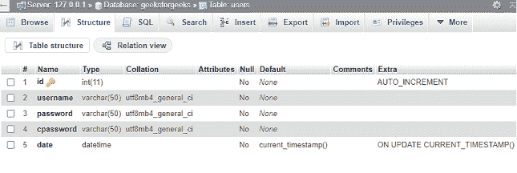
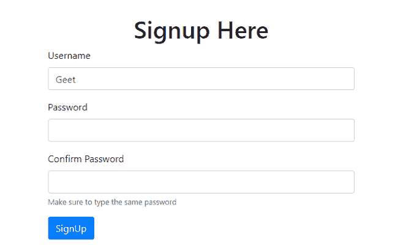
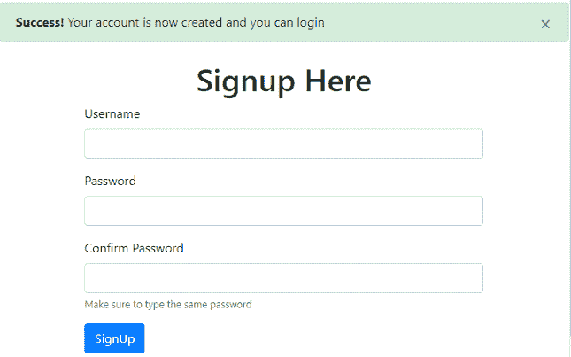
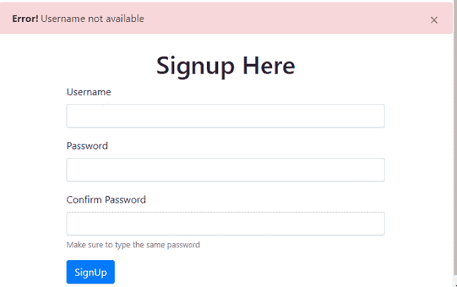

# 使用 PHP 和 MySQL 数据库的注册表单

> 原文:[https://www . geesforgeks . org/registration-form-use-PHP-and-MySQL-database/](https://www.geeksforgeeks.org/signup-form-using-php-and-mysql-database/)

任务是创建和设计一个注册表单，在这个表单中，如果用户输入详细信息，HTML 表单数据将被插入到我们的 MySQL 服务器数据库中。

**进场:**

*   第一个任务是我们必须根据我们的需求创建我们的 MySQL 服务器数据库和一个表。
*   我们使用 PHP**MySQL _ connect()**函数连接我们的 MySQL 服务器数据库，该函数接受四个参数，即我们的“服务器名”、“用户名”、“密码”和“数据库”。

**注意:**这里没有使用 CSS 代码，因为我们在下面的 PHP 代码中使用了 Bootstrap。您可以根据自己的应用需求在网页中应用 CSS 和样式。

**创建数据库连接的 PHP 代码:**首先也是最基本的一步是创建数据库连接。这里使用的 PHP 文件名是**“dbconnect . PHP”**，使用的数据库名是**“极客 forgeeks”**。

```phphtml
<?php

    $servername = "localhost"; 
    $username = "root"; 
    $password = "";

    $database = "geeksforgeeks";

     // Create a connection 
     $conn = mysqli_connect($servername, 
         $username, $password, $database);

    // Code written below is a step taken
    // to check that our Database is 
    // connected properly or not. If our 
    // Database is properly connected we
    // can remove this part from the code 
    // or we can simply make it a comment 
    // for future reference.

    if($conn) {
        echo "success"; 
    } 
    else {
        die("Error". mysqli_connect_error()); 
    } 
?>
```

“**用户**”表是使用 MySQL **phpMyAdmin** 工具创建的，如下图所示。



**设计注册表单的 PHP 代码:**现在，当我们成功连接到我们的数据库时，是时候为用户创建注册表单了。下面的 PHP 代码演示了注册表单。使用的 MySql 数据库表名是**“用户”**。

```phphtml
<?php

$showAlert = false; 
$showError = false; 
$exists=false;

if($_SERVER["REQUEST_METHOD"] == "POST") {

    // Include file which makes the
    // Database Connection.
    include 'dbconnect.php';   

    $username = $_POST["username"]; 
    $password = $_POST["password"]; 
    $cpassword = $_POST["cpassword"];

    $sql = "Select * from users where username='$username'";

    $result = mysqli_query($conn, $sql);

    $num = mysqli_num_rows($result); 

    // This sql query is use to check if
    // the username is already present 
    // or not in our Database
    if($num == 0) {
        if(($password == $cpassword) && $exists==false) {

            $hash = password_hash($password, 
                                PASSWORD_DEFAULT);

            // Password Hashing is used here. 
            $sql = "INSERT INTO `users` ( `username`, 
                `password`, `date`) VALUES ('$username', 
                '$hash', current_timestamp())";

            $result = mysqli_query($conn, $sql);

            if ($result) {
                $showAlert = true; 
            }
        } 
        else { 
            $showError = "Passwords do not match"; 
        }      
    }// end if 

   if($num>0) 
   {
      $exists="Username not available"; 
   } 

}//end if   

?>

<!doctype html>

<html lang="en">

<head>

    <!-- Required meta tags --> 
    <meta charset="utf-8"> 
    <meta name="viewport" content=
        "width=device-width, initial-scale=1, 
        shrink-to-fit=no">

    <!-- Bootstrap CSS --> 
    <link rel="stylesheet" href=
"https://stackpath.bootstrapcdn.com/bootstrap/4.5.0/css/bootstrap.min.css"
        integrity=
"sha384-9aIt2nRpC12Uk9gS9baDl411NQApFmC26EwAOH8WgZl5MYYxFfc+NcPb1dKGj7Sk"
        crossorigin="anonymous">  
</head>

<body>

<?php

    if($showAlert) {

        echo ' <div class="alert alert-success 
            alert-dismissible fade show" role="alert">

            <strong>Success!</strong> Your account is 
            now created and you can login. 
            <button type="button" class="close"
                data-dismiss="alert" aria-label="Close"> 
                <span aria-hidden="true">×</span> 
            </button> 
        </div> '; 
    }

    if($showError) {

        echo ' <div class="alert alert-danger 
            alert-dismissible fade show" role="alert"> 
        <strong>Error!</strong> '. $showError.'

       <button type="button" class="close" 
            data-dismiss="alert aria-label="Close">
            <span aria-hidden="true">×</span> 
       </button> 
     </div> '; 
   }

    if($exists) {
        echo ' <div class="alert alert-danger 
            alert-dismissible fade show" role="alert">

        <strong>Error!</strong> '. $exists.'
        <button type="button" class="close" 
            data-dismiss="alert" aria-label="Close"> 
            <span aria-hidden="true">×</span> 
        </button>
       </div> '; 
     }

?>

<div class="container my-4 ">

    <h1 class="text-center">Signup Here</h1> 
    <form action="signup.php" method="post">

        <div class="form-group"> 
            <label for="username">Username</label> 
        <input type="text" class="form-control" id="username"
            name="username" aria-describedby="emailHelp">    
        </div>

        <div class="form-group"> 
            <label for="password">Password</label> 
            <input type="password" class="form-control"
            id="password" name="password"> 
        </div>

        <div class="form-group"> 
            <label for="cpassword">Confirm Password</label> 
            <input type="password" class="form-control"
                id="cpassword" name="cpassword">

            <small id="emailHelp" class="form-text text-muted">
            Make sure to type the same password
            </small> 
        </div>      

        <button type="submit" class="btn btn-primary">
        SignUp
        </button> 
    </form> 
</div>

<!-- Optional JavaScript --> 
<!-- jQuery first, then Popper.js, then Bootstrap JS -->

<script src="
https://code.jquery.com/jquery-3.5.1.slim.min.js"
    integrity="
sha384-DfXdz2htPH0lsSSs5nCTpuj/zy4C+OGpamoFVy38MVBnE+IbbVYUew+OrCXaRkfj"
    crossorigin="anonymous">
</script>

<script src="
https://cdn.jsdelivr.net/npm/popper.js@1.16.0/dist/umd/popper.min.js"
    integrity=
"sha384-Q6E9RHvbIyZFJoft+2mJbHaEWldlvI9IOYy5n3zV9zzTtmI3UksdQRVvoxMfooAo" 
    crossorigin="anonymous">
</script>

<script src="
https://stackpath.bootstrapcdn.com/bootstrap/4.5.0/js/bootstrap.min.js" 
    integrity=
"sha384-OgVRvuATP1z7JjHLkuOU7Xw704+h835Lr+6QL9UvYjZE3Ipu6Tp75j7Bh/kR0JKI"
    crossorigin="anonymous">
</script> 
</body> 
</html>
```

**输出:**

*   **报名表格:**
    
*   **用户登录成功后:**
    
*   **无效用户登录后:**
    