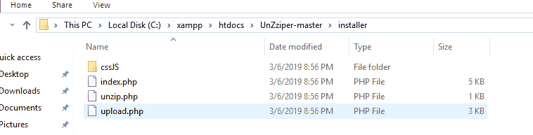
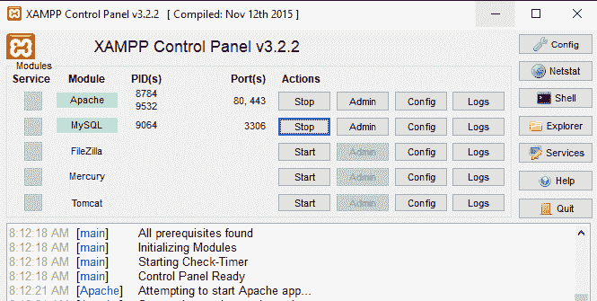
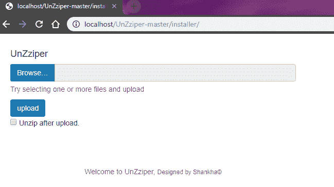
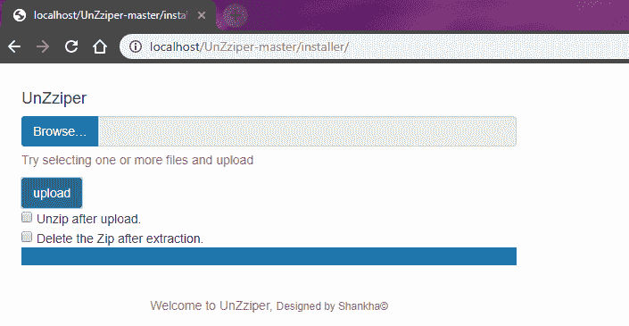

# PHP 上传进度条

> 原文:[https://www.geeksforgeeks.org/upload-progress-bar-in-php/](https://www.geeksforgeeks.org/upload-progress-bar-in-php/)

[XAMPP](https://en.wikipedia.org/wiki/XAMPP) 是一个由 Apache 开发的免费开源的跨平台 web 服务器解决方案堆栈包，允许 web 应用程序在本地 web 服务器上轻松测试。但是当使用 PHP 将文件上传到服务器时，这是一个令人头疼的问题。在大多数情况下，PHP 服务器不允许上传大于 30 兆字节(30MB)的文件。

> 仅使用 PHP，我们不能创建进度条界面，因为 PHP 不会提供响应，直到上传完成。因此，为了创建一个进度条界面，我们必须使用 JavaScript 和 PHP。

**更改文件上传大小限制:**
编辑 *php.ini* 文件更改服务器上的上传文件大小。为了确保文件上传正常工作，post_max_size 指令应该比 upload_max_filesize 稍大一些。例如，以下设置演示了如何将文件上载限制设置为 100 兆字节:

```php
upload_max_filesize = 100M
post_max_size = 101M

```

**现在，如果你的托管提供商不允许你访问“php.ini”文件怎么办？**
在这种情况下，建议使用 JavaScript 将你的大文件以小 blobs 的形式上传到服务器。JavaScript 会将您的本地文件分成多个文件，并尝试将这些文件上传到服务器。这里你必须记住，你的 blob 大小不能超过你的 PHP 主机的上传大小限制。

**运行上传进度栏项目的步骤:**

*   从 [Github](https://github.com/shankha96/UnZziper) 下载完整项目。
*   使用 Winrar 提取压缩文件。
*   将提取的文件保存在 XAMPP htdocs 文件夹中。
    
*   运行 XAMPP 服务器。
    
*   Now, open browser tab and type localhost/geeks/index.php or localhost/geeks on the address bar. It will display the output.
    

    