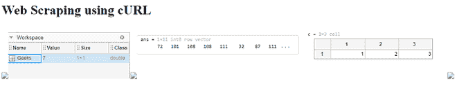

# 在 PHP 中使用 cURL 进行网页报废

> 原文:[https://www . geesforgeks . org/web-报废-使用-curl-in-php/](https://www.geeksforgeeks.org/web-scrapping-using-curl-in-php/)

我们都尝试过用多种方式从网站获取数据。在本文中，我们将学习如何使用僵尸工具从网站提取内容和数据。

我们将使用 [PHP cURL](https://www.geeksforgeeks.org/php-curl/) 来刮一个网页，它看起来像是一个大写锁定的错别字，但实际上你就是这样写的。cURL 是用 PHP 进行 HTTP 请求的系统。这是从脚本中调用网页的方式。

**刮数据，不刮内容**这句话是给所有想学网页刮的人说的。cURL 和 web scratch 是强大的工具，可以用来自动化一些冗长乏味的重复任务。我们应该只刮信息，而不是完整的文章和内容。****

******示例:**以下示例演示了从文章[https://www.geeksforgeeks.org/matlab-data-types/](https://www.geeksforgeeks.org/matlab-data-types/)中抓取图像****

## ****服务器端编程语言（Professional Hypertext Preprocessor 的缩写）****

```
**<?php

// Intialize curl
$ch = curl_init();

// URL for Scraping
curl_setopt($ch, CURLOPT_URL,
    'https://www.geeksforgeeks.org/matlab-data-types/');

// Return Transfer True
curl_setopt($ch, CURLOPT_RETURNTRANSFER, true);

$output = curl_exec($ch);

// Closing cURL
curl_close($ch);

// For web page display
echo '<head>';
echo '<meta http-equiv="content-type" 
    content="text/html; charset=utf-8" />';
echo '</head>';
echo '<body>';

echo '<h1>Web Scraping using cURL</h1>';

// Checking for images 
preg_match_all(
'!https://media.geeksforgeeks.org/wp-content/uploads/(.*)/(.*).png!',
    $output, $data
);

foreach ($data[0] as $list) {
    echo "";
}

echo '</body>';

?>**
```

******输出:******

****

刮网****