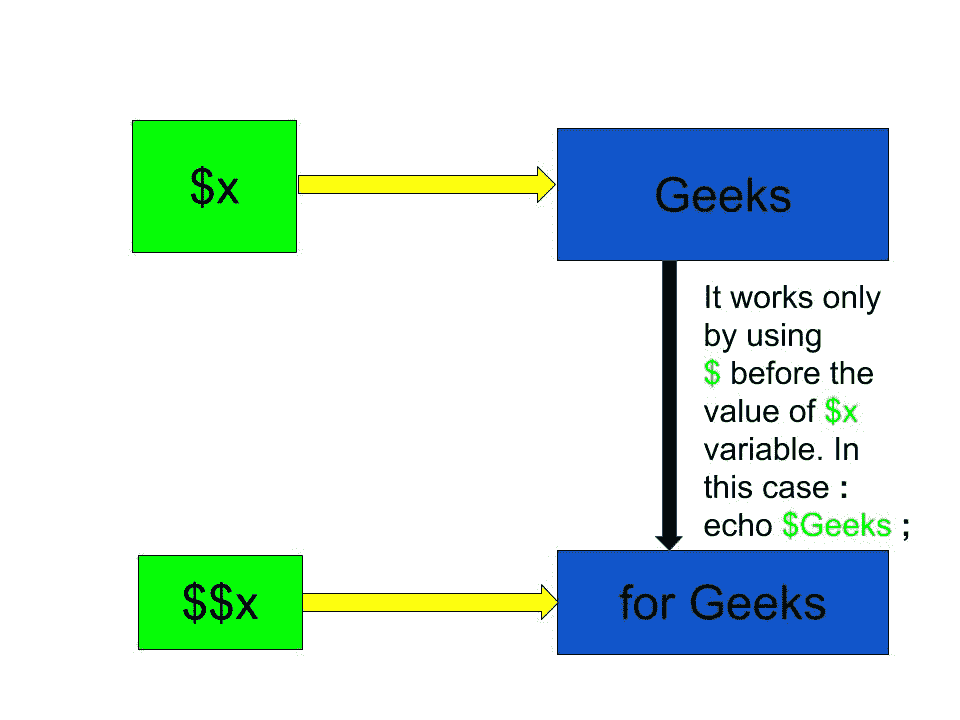

# 在 PHP 中$(美元美元或双美元)是什么意思？

> 原文:[https://www . geeksforgeeks . org/一美元或两美元在 php 中意味着什么/](https://www.geeksforgeeks.org/what-does-dollar-dollar-or-double-dollar-means-in-php/)

$x(单美元)是名为 **x** 的普通变量，它存储任何值，如字符串、整数、浮点数等。$x(双元)是一个引用变量，它存储可以通过在$x 值之前使用$符号来访问的值。
从下图可以很容易理解:

*   $x 存储字符串类型的值“极客”。
*   现在引用变量$x 在字符串类型的变量中存储了“对于极客”的值。



因此，“对于极客”的价值可以通过以下两种方式获得:

*   通过直接使用引用变量。**例:**echo $ x；
*   通过使用存储在变量$x 中的值作为变量名来访问“for Geeks”值。例子:echo $ Geeks 这将给出“给极客”的输出(不带引号)。

**示例:**

```
Input : $x = "Geeks";  
        $x = for Geeks;  
        echo "$x ";  
        echo "$x;";   
        echo $Geeks;
Output : Geeks 
         for Geeks
         for Geeks

Input : $x = "Rajnish";  
        $x = "Noida";  
        echo "$x lives in " . $Rajnish;
Output : Rajnish lives in Noida

```

下面的例子说明了$和$在 PHP 中的使用:

**示例-1:**

```
<?php 

// Declare variable and initialize it
$x = "Geeks";     

// Reference variable
$x = "GeeksforGeeks";

// Display value of x
echo $x . "\n"; 

// Display value of $x ($Geeks)
echo $x . "\n"; 

// Display value of $Geeks
echo "$Geeks";

?>
```

**Output:**

```
Geeks
GeeksforGeeks
GeeksforGeeks

```

**示例-2:**

```
<?php 

// Declare variable and initialize it
$var = "Geeks"; 

// Reference variable
${$var}="GeeksforGeeks"; 

// Use double reference variable
${${$var}}="computer science";

// Display the value of variable
echo $var . "\n"; 
echo $Geeks . "\n"; 
echo $GeeksforGeeks . "\n"; 

// Double reference
echo ${${$var}}. "\n"; 

?> 
```

**Output:**

```
Geeks
GeeksforGeeks
computer science
computer science

```