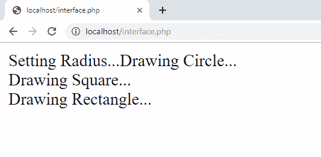

# PHP 中的接口有什么意义？

> 原文:[https://www . geesforgeks . org/什么是 php 中的接口点/](https://www.geeksforgeeks.org/what-is-the-point-of-interfaces-in-php/)

接口允许用户创建指定类必须实现的公共方法的程序，而不涉及如何实现特定方法的复杂性和细节。它通常被称为下一个抽象层次。它类似于抽象方法，类似于抽象类。接口的定义就像类的定义一样，但是类关键字被接口关键字和函数原型所代替。该接口不包含数据变量。接口在某种程度上是有帮助的，因为它确保为程序员的所有方法维护一种元数据。
在 PHP 中，我们可以做面向对象编程。这意味着我们可以利用面向对象的概念，比如创建类和对象，使用继承等等。OOPs 主要包含三种不同类型的继承。分别是:单继承、多继承、多级继承。现在，PHP 支持单级和多级继承。PHP 中不直接支持多重继承，但是可以使用 Interface 实现。所以，PHP 中接口的主要原因是实现多重继承。
在多重继承中，我们可以从两个或多个父类中派生出一个子类。下面是我们如何在 PHP 中实现多重继承。

我们有如下三个不同的类:

```
class Circle {
    public function draw(){
        //
    }
    public function setRadius() {
        //
    }
}

class Square {
    public function draw(){
        //
    }
}

class Rectangle {
    public function draw(){
        //
    }
}

```

如上图所示，我们在所有三个类**中都有相同的函数 draw()** 并且在类 Circle 中还有一个函数作为 **setRadius()** 。现在我们已经创建了三个不同的接口，并在我们的类中实现了它们，如下所示:

```
interface Shape {
    public function draw();
}

interface Radius {
    public function setRadius();
}

interface Main {
    public function process();
}

class Circle implements Shape, Radius, Main {
    public function draw(){
        echo "Drawing Circle...";
    }
    public function setRadius() {
        echo "Setting Radius...";
    }
    public function process() {
        $this->setRadius();
        $this->draw();
    }
}

class Square implements Shape, Main {
    public function draw(){
        echo "Drawing Square...";
    }
    public function process() {
        $this->draw();
    }
}

class Rectangle implements Shape, Main {
    public function draw(){
        echo "Drawing Rectangle...";
    }
    public function process() {
        $this->draw();
    }
}

```

如上所示，我们在类中实现了不止一个接口。 **Shape** 和 **Main** 接口在所有类中都实现了，但是 **Radius** 接口只是在 Circle 类中实现。

然后第四个类叫做 **DrawShape** 就出现了，因为我们想在所有类中调用 **process()** 函数。 **process()** 函数是调用该类中的所有函数。

```
class DrawShape {
    public function newShape(Main $shape) {
        return $shape->process();
    }
}

```

**示例:**

```
<?php

interface Shape {
    public function draw();
}

interface Radius {
    public function setRadius();
}

interface Main {
    public function process();
}

class Circle implements Shape, Radius, Main {

    public function draw(){
        echo "Drawing Circle...";
        echo "<br>";
    }

    public function setRadius() {
        echo "Setting Radius...";
    }

    // To call all the functions in this class
    public function process() {
        $this->setRadius();
        $this->draw();
    }

}

class Square implements Shape, Main {

    public function draw(){
        echo "Drawing Square...";
        echo "<br>";
    }

    // To call all the functions in this class
    public function process() {
        $this->draw();
    }

}

class Rectangle implements Shape, Main {

    public function draw(){
        echo "Drawing Rectangle...";
        echo "<br>";
    }

    // To call all the functions in this class
    public function process() {
        $this->draw();
    }

}

class DrawShape {

    public function newShape(Main $shape) {
        return $shape->process();
    }

}

// To Draw Circle
$shapeCircle = new Circle();
$drawCircle = new DrawShape();
$drawCircle->newShape($shapeCircle);

// To Draw Square
$shapeSquare = new Square();
$drawSquare = new DrawShape();
$drawSquare->newShape($shapeSquare);

// To Draw Rectangle
$shapeRectangle = new Rectangle();
$drawSquare = new DrawShape();
$drawSquare->newShape($shapeRectangle);

?>
```

**输出:**
