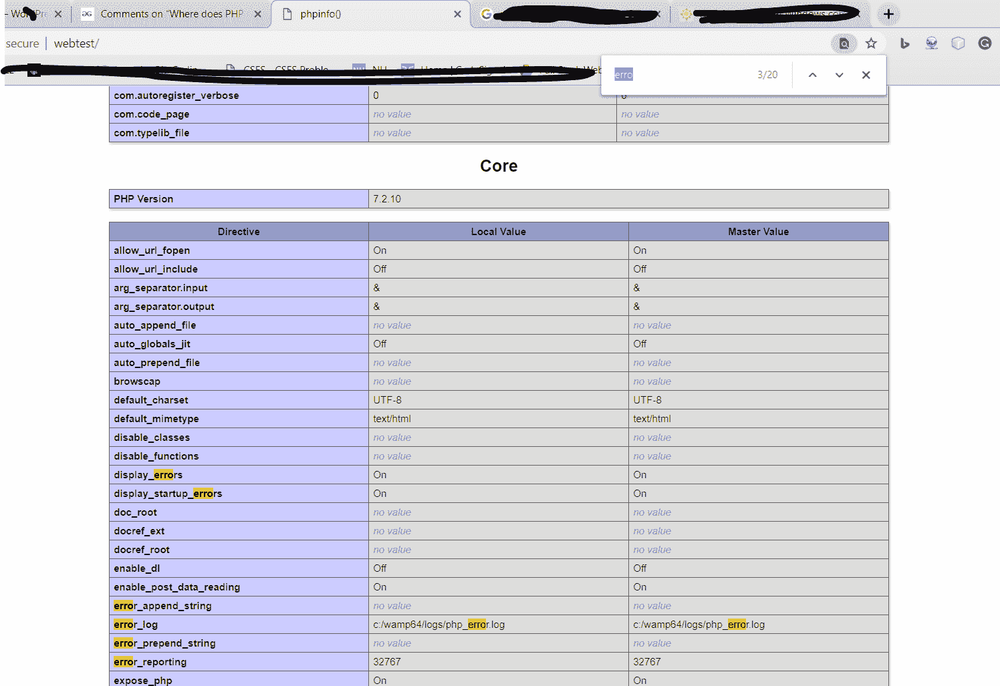
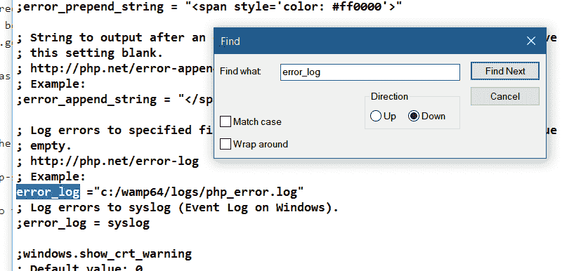

# PHP 在哪里存储错误日志？(php5、apache、fastcgi、cpanel)

> 原文:[https://www . geesforgeks . org/where-PHP-store-the-error-log-PHP 5-Apache-fastcgi-cpanel/](https://www.geeksforgeeks.org/where-does-php-store-the-error-log-php5-apache-fastcgi-cpanel/)

可以使用 phpinfo()函数检查错误日志文件的位置。创建一个包含 phpinfo()函数的简单 PHP 文件并运行它。它将显示关于 PHP 配置的信息。

```php
<?php phpinfo(); ?>
```

运行上面的程序，在 chrome 上使用 f3 搜索 error_log 指令。这将显示日志文件的位置。下面是一个在 WAMP 服务器上运行的示例，但是对于每个开发堆栈，过程将与下面描述的相同。



按照指定打开您的 **php.ini** 文件，并编辑以下指令，以指定错误日志文件到其他位置的路径。

显示 _ 错误=关闭

然后，您必须通过 error_log 指令给出日志文件的路径，如下所示:


可以在 UNIX/Linux 上使用以下命令直接找到 php.ini 文件的路径。

php -to |grep php.ini

PHP 包含一个简单有效的解决方案，可以将所有日志错误显示到日志文件中。必须关闭使用网络浏览器向最终用户显示服务器上的错误。PHP 提供了大量与路径、数据库模式和所有其他敏感信息相关的信息。它强烈建议使用错误日志来代替生产网站上的错误显示。这个想法有助于仅向开发人员显示错误日志。PHP 提供将所有错误记录在日志文件中，而不是通过网络浏览器向最终用户显示错误。要做到这一点，首先你必须在 php.ini 文件中关闭通过浏览器显示错误，方法是如上所述将 display_errors 指令设置为 off。然后，您必须通过 error_log 指令给出日志文件的路径，如下所示:
Ex:error _ log =/var/log/php-scripts.log，错误将记录在 PHP-scripts . log 文件中。