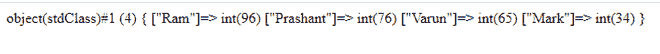

# PHP 中使用哪些函数对 JSON 文件进行编码和解码？

> 原文:[https://www . geesforgeks . org/哪些函数用于对 php 中的 json 文件进行编码和解码/](https://www.geeksforgeeks.org/which-functions-are-used-to-encode-and-decode-json-file-in-php/)

[JSON](https://www.geeksforgeeks.org/javascript-json/) 代表 JavaScript 对象符号。像 XML 一样，它是一种基于文本的数据交换格式，易于读写，并且比其他格式更轻。JSON 基于两个基本结构，即[对象](https://www.geeksforgeeks.org/objects-in-javascript/)和[数组。](https://www.geeksforgeeks.org/arrays-in-javascript/)

**解析 PHP 中的 JSON 数据:**PHP 中内置了对 JSON 数据进行编码和解码的功能。这些功能是 [**json_encode()**](https://www.geeksforgeeks.org/php-json_encode-function/) 和 [**json_decode()**](https://www.geeksforgeeks.org/php-json_decode-function/) 。这些函数只适用于 UTF 8 编码的字符串。

**在 PHP 中解码 JSON 数据:**在 PHP 中解码 JSON 数据非常容易。你只需要使用 **json_decode()** 函数将 json 对象转换成合适的 PHP 数据类型。

**示例:**默认情况下， **json_decode()** 函数返回一个对象。您可以选择指定接受布尔值的第二个参数。当设置为“真”时， [JSON 对象](https://www.geeksforgeeks.org/javascript-json-objects/)被解码为[关联数组](https://www.geeksforgeeks.org/associative-arrays-in-php/)。

## 服务器端编程语言（Professional Hypertext Preprocessor 的缩写）

```php
<?php
    $student_data = '{"Ram":96,"Prashant":76,"Varun":65,"Mark":34}';

    // Decoding above JSON String into JSON object
    $decoded = json_decode($student_data);

    // Dump the $decoded variable
    var_dump($decoded);
?>
```

**输出:**



**用 PHP 编码 JSON 数据:**用 PHP 编码 JSON 数据和用 PHP 编码 JSON 数据一样简单。我们使用**[**JSON _ encode()**](https://www.geeksforgeeks.org/php-json_encode-function/)函数，被编码的数据可以是除了像文件句柄这样的资源之外的任何 PHP 数据类型。**

****示例 1:** 下面的代码演示了 PHP 关联数组的编码。**

## **服务器端编程语言（Professional Hypertext Preprocessor 的缩写）**

```php
<?php

    // PHP associative array
    $student_data = array(
        "Ram"=>96, 
        "Prashant"=>76, 
        "Varun"=>65, 
        "Mark"=>34
    );

    // Encoding PHP Associative array using json_encode()
    $encoded = json_encode($student_data);

   // Echo the data
    echo $encoded;
?>
```

****输出:****

```php
{"Ram":96,"Prashant":76,"Varun":65,"Mark":34} 
```

****示例 2:** 下面的代码演示了 PHP 索引数组的编码。**

## **服务器端编程语言（Professional Hypertext Preprocessor 的缩写）**

```php
<?php

   // PHP associative array
   $students = array("Ram", "Prashant", "Varun", "Mark");

   // Encoding PHP Associative array using json_encode()
   $encoded = json_encode($students);

   // Echo the data
   echo $encoded;
?>
```

****输出:****

```php
["Ram","Prashant","Varun","Mark"]
```