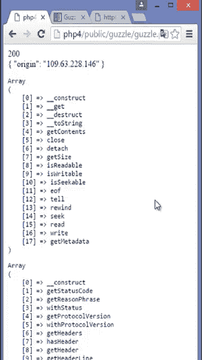

# PHP 中为什么用 Guzzle 代替 cURL？

> 原文:[https://www . geesforgeks . org/why-use-guzzle-代替-curl-in-php/](https://www.geeksforgeeks.org/why-use-guzzle-instead-of-curl-in-php/)

**什么是[卷曲](https://www.geeksforgeeks.org/php-curl/)？**
cURL 是 PHP 中的一个模块，用它我们可以使用 libcurl。libcurl 是一个在 PHP 中使用的库，用于创建连接并与各种不同的服务器通信，这些服务器可能具有不同类型的协议。cURl 为我们提供了各种预构建函数，比如–cURl _ init()、curl _ setopt()、curl_exec()、curl_close()。

**cURL 的限制:**

*   cURL 不支持任何递归下载逻辑。
*   cURL 需要额外的选项来下载。
*   不为我们提供异步和同步请求。

**示例:**这些是使用 cURL 发出的请求。

```php
<?php>

// Get cURL resource
$curl = curl_init();
// Set some options 
curl_setopt($ch, CURLOPT_POST, 
    "https://jsonplaceholder.typicode.com/users");

curl_setopt($ch, CURLOPT_POST, false) ;

curl_setopt($ch, CURLOPT_RETURNTANSFER, false) ;
$result = curl_exec($ch);
curl_close($ch);

?>
```

**输出:**


**什么是狂饮？**
Guzzle 是一个微框架(抽象层)，它是一个 PHP HTTP 客户端，因此 HTTP 请求很容易发送，与 web 服务集成也很简单。Guzzle 可以和任何 HTTP 处理程序一起使用，比如 cURL、socket、PHP 的流包装器。Guzzle 默认使用 cURL 作为 Http 处理程序。

**PHP 中为什么用 Guzzle 代替 cURL？**

*   它提供了简单的用户界面。
*   狂饮可以使用各种 HTTP 客户端。
*   它为我们提供了异步和同步请求的便利。
*   Guzzle 内置了单元测试支持，这使得编写应用程序单元测试和模拟 http 请求变得更加容易。

**示例:**这些是使用 Guzzle 发出的请求。

```php
<?php

use GuzzleHTTP\Client;
require '>>/vendor/autoload.php';

$client = new Client([
    'base_uri'=>'http://httpbin.org',
    'timeout' => 2.0
]);

$response = $client->request('GET', 'ip');

echo $response->getStatusCOde(), "<br>";
$body = $response->getBody();
echo $body->getContents(), "<br>";

echo "<pre>";
print_r(get_class_methods($body));
echo "</pre>";
echo "<pre>";
print_r(get_class_methods($response));
echo "</pre>";
?>
```

**输出:**
